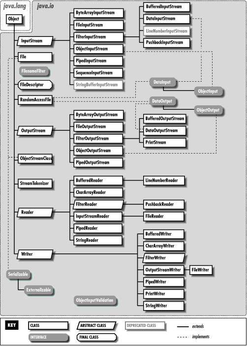
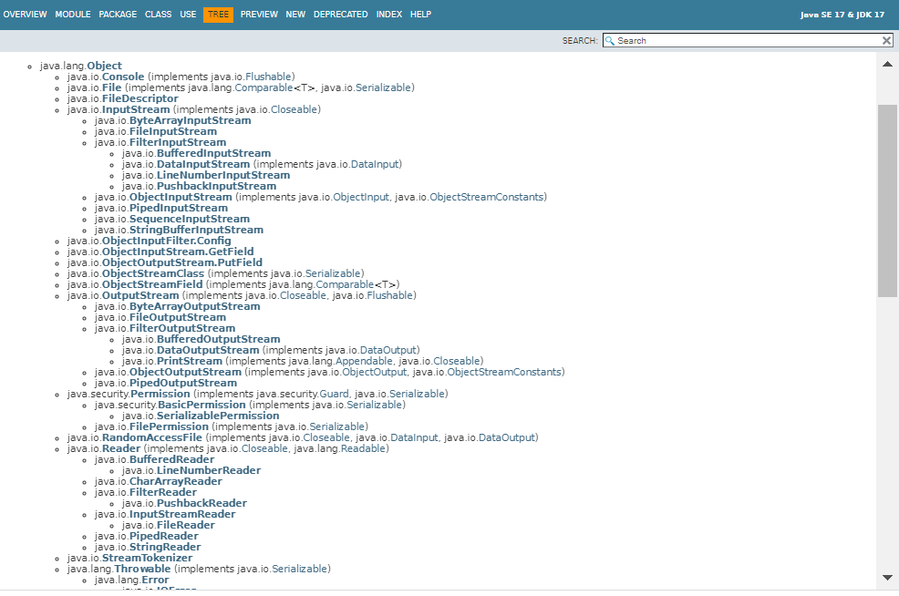
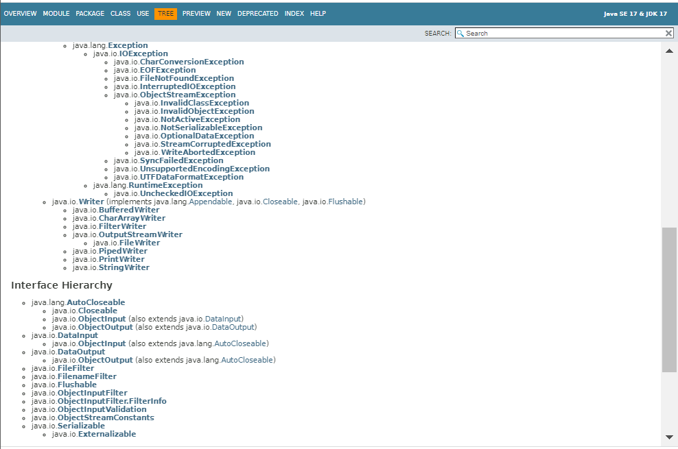
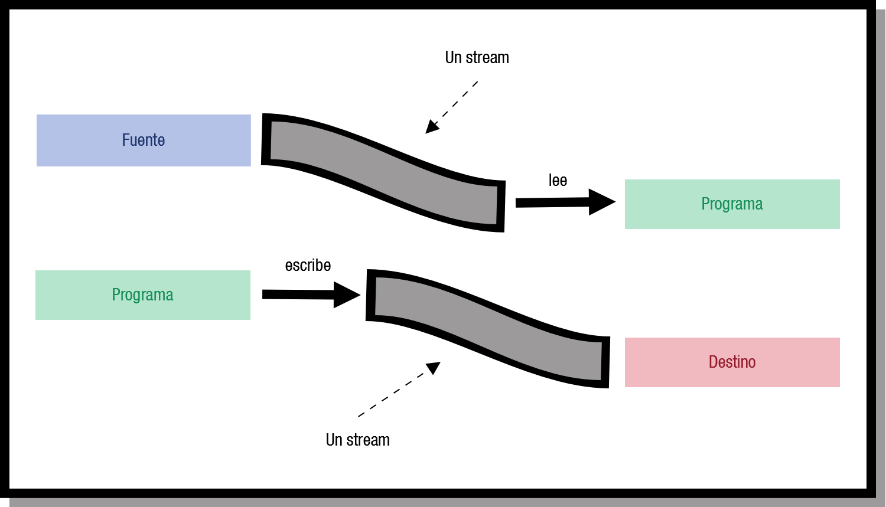
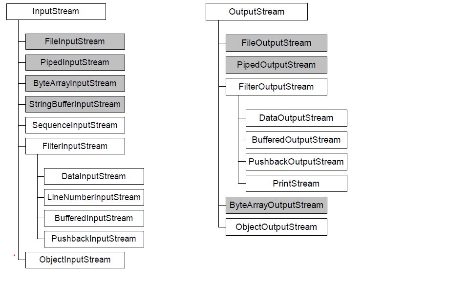
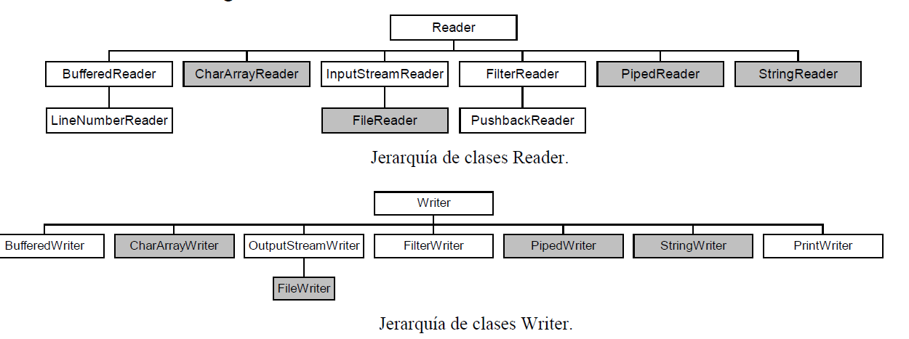
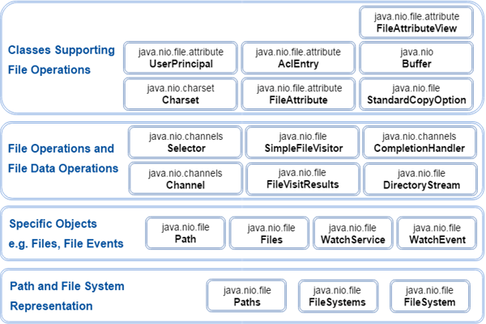

# UT02-A: Manejo de ficheros

> **Módulo:** Acceso a Datos (DAM 2)
> **Unidad:** UT02 - Persistencia en ficheros y XML
> **Tema:** 2A - Manejo de ficheros (`java.io`)
> **Documento oficial PDF:** [`2A Manejo de ficheros _ AulaVirtual.pdf`](../recursos/2A%20Manejo%20de%20ficheros%20_%20AulaVirtual/2A%20Manejo%20de%20ficheros%20_%20AulaVirtual.pdf)
---

## 1. Introducción

Si estás estudiando este módulo, es probable que ya hayas estudiado el de programación, por lo que no te serán desconocidos muchos conceptos que se tratan en este tema.

Ya sabes que cuando apagas el ordenador, los datos de la memoria RAM se pierden. Un ordenador utiliza ficheros para guardar los datos.

Se llama **datos persistentes** a los datos que se guardan en ficheros porque persisten más allá de la ejecución de la aplicación que los trata. Los ordenadores almacenan los ficheros en unidades de almacenamiento secundario, como discos duros, discos ópticos, etc. En esta unidad veremos, entre otras cosas, cómo realizar con Java las operaciones de creación, actualización y procesamiento de ficheros.

Las operaciones que constituyen un flujo de información entre el programa y el exterior se conocen como entrada/salida (E/S).

Hay dos paquetes en Java que contienen las clases necesarias para la gestión de ficheros: `java.io` y `java.nio`. Entre los dos proporcionan las siguientes características:

- Entrada y salida con flujos (_streams_) y serialización.
- Charsets, decodificadores y codificadores para caracteres.
- Acceso al sistema de archivos, a los archivos y a sus atributos.
- API para desarrollar servidores escalables con E/S asíncrona, multiplexada y no bloqueante (no lo abordamos en este curso).

**`java.io`** se basa en el concepto de flujo (_stream_) y es bloqueante, mientras que las operaciones de E/S con **`java.nio`** se basan en los conceptos de búfer y canal (_channel_) y no son bloqueantes.

**`java.io`** es el paquete tradicional de la API de Java para realizar operaciones de E/S.
Incorpora interfaces, clases y excepciones para acceder a todo tipo de ficheros.
La librería `java.io` contiene las clases necesarias para gestionar las operaciones de entrada y salida con Java. Estas clases de E/S se pueden agrupar en varias categorías fundamentales.

**`java.nio` (Non-Blocking I/O)** se introdujo en la API de Java en la versión 1.4 como una extensión eficiente de los paquetes `java.io` y `java.net`. Java NIO ofrece una forma de trabajar con E/S diferente de la API de E/S estándar. Se basa en el _buffer_ y el _channel_.

**`java.io` frente a `java.nio`**

- Dependiendo de lo que necesitemos, pueden ser complementarios y se pueden utilizar conjuntamente ambos paquetes.
- `java.nio` permite manejar múltiples canales (archivos o conexiones de red) con uno o unos pocos hilos.
- En `java.nio`, el procesamiento de datos es más complicado que con los flujos bloqueantes de `java.io`.
- `java.nio` es la opción si necesito manejar cientos de conexiones (canales) abiertas y una pequeña cantidad de datos en cada una.
- `java.io` es la opción si voy a manejar pocas conexiones con un alto ancho de banda (envío mucha información a la vez).
- Hasta JSE 7, `java.io.File` era la clase utilizada para realizar operaciones de E/S con archivos.
- Esta clase tenía limitaciones.
- El paquete `java.nio.file`, incorporado a partir de JSE 7, resuelve estos problemas.
- Es el que debemos usar para trabajar con archivos, independientemente de si realizamos E/S con flujos (`java.io`) o con búferes y canales (`java.nio`).

## 2. java.io

Este capítulo cubre las clases de la plataforma Java utilizadas para la E/S básica.

La librería `java.io` contiene las clases necesarias para gestionar las operaciones de entrada y salida con Java. Se basa en flujos de E/S (_streams_), un potente concepto que simplifica enormemente las operaciones de E/S. Más adelante, analizaremos la serialización, que permite que un programa escriba objetos completos en flujos y los vuelva a leer, y las operaciones de E/S de archivos y del sistema de archivos, _incluidos los archivos de acceso aleatorio_.

Las clases de E/S de la librería `java.io` se pueden agrupar fundamentalmente en:

- Clases para leer entradas desde un flujo de datos.
- Clases para escribir entradas a un flujo de datos.
- Clases para operar con ficheros en el sistema de ficheros local.
- Clases para gestionar la serialización de objetos.

En la imagen puedes ver las clases disponibles en `java.io`.



[Enlace a la documentación de Oracle para JDK 17](https://docs.oracle.com/en/java/javase/17/docs/api/java.base/java/io/package-summary.html):





### 2.1. Streams o flujos

Un **flujo** es una **abstracción de todo aquello que produce o consume información**.

La vinculación de este flujo al dispositivo físico la hace el sistema de entrada y salida de Java.

Un flujo (_stream_) es una conexión entre el programa y la fuente o el destino de los datos. La información se traslada en serie (un carácter a continuación de otro) a través de esta conexión. Esto da lugar a una forma general de representar muchos tipos de comunicaciones.

Las clases y los métodos de E/S que necesitamos emplear son los mismos, independientemente del dispositivo con el que estemos actuando. El núcleo de Java sabrá si tiene que tratar con el teclado, el monitor, un sistema de archivos o un socket de red, lo que libera al programador de tener que saber con quién está interactuando.



Java define dos tipos de flujos en el paquete `java.io`:

- **Byte streams (8 bits):** proporcionan lo necesario para la gestión de entradas y salidas de bytes, y su uso está orientado a la lectura y escritura de datos binarios. El tratamiento del flujo de bytes viene determinado por dos clases abstractas: `InputStream` y `OutputStream`. Estas dos clases definen los métodos que implementarán sus subclases y, entre todos ellos, destacan `read()` y `write()`, que leen y escriben bytes de datos, respectivamente.
- **Character streams (16 bits):** de manera similar a los flujos de bytes, los flujos de caracteres están determinados por dos clases abstractas: `Reader` y `Writer`. Dichas clases manejan flujos de caracteres Unicode. De ellas también derivan subclases concretas que implementan los métodos definidos en ellas; los más destacados son `read()` y `write()`, que leen y escriben caracteres, respectivamente.

### 2.2. Clases asociadas a los flujos

**Flujos de bytes**

La entrada y salida de datos del programa se puede realizar con clases derivadas de `InputStream` (para lectura) y `OutputStream` (para escritura). Estas clases tienen los métodos básicos `read()` y `write()`, que **manejan bytes**. En la siguiente figura se muestran las clases que derivan de `InputStream` y las que derivan de `OutputStream`.



Las clases `FileInputStream` y `FileOutputStream` manejan los flujos de bytes dirigidos hacia ficheros o provenientes de ficheros. Los veremos más adelante.

**Flujos de caracteres**

Las clases que manejan flujos de caracteres Unicode son `Reader` y `Writer`, de las que derivan, entre otras, `FileReader` y `FileWriter`, que se utilizan para la lectura y escritura de caracteres en un fichero.



Las clases con fondo gris definen de dónde proceden o adónde se envían los datos, es decir, el dispositivo con el que conecta el flujo. Las demás (con fondo blanco) añaden características particulares a la forma de enviarlos.

Las clases `InputStreamReader` y `OutputStreamWriter` convierten flujos de caracteres en flujos de bytes.

### 2.3. Formas de acceso a un fichero

En Java puedes utilizar dos tipos de ficheros (de texto o binarios) y dos tipos de acceso a los ficheros (secuencial o aleatorio). No obstante, según la literatura que consultemos, a veces se distingue una tercera forma de acceso denominada concatenación, tuberías o _pipes_.

- Acceso aleatorio: los archivos de acceso aleatorio, al igual que sucede habitualmente con la memoria (RAM = _Random Access Memory_), permiten acceder a los datos de forma no secuencial o desordenada. Esto implica que el archivo debe estar disponible en su totalidad en el momento de acceder a él, algo que no siempre es posible.
- Acceso secuencial: en este caso, los datos se leen de manera secuencial, desde el comienzo del archivo hasta el final (que muchas veces no se conoce a priori). Este es el caso de la lectura del teclado o la escritura en una consola de texto: no se sabe cuándo terminará de escribir el operador.

### 2.4. Clase File

**¿Para qué sirve esta clase, qué nos permite?** La clase `File` proporciona una representación abstracta de ficheros y directorios.

Esta clase permite examinar y manipular archivos y directorios, independientemente de la plataforma en la que se esté trabajando: Linux, Windows, etc.

Las instancias de la clase **`File`** representan nombres de archivo, no los archivos en sí mismos.

Es posible que el archivo correspondiente a un nombre no exista; por esta razón, habrá que controlar las posibles excepciones.

Un objeto de la clase `File` permite examinar el nombre del archivo, descomponerlo en su rama de directorios o crear el archivo si no existe, pasando el objeto de tipo `File` a un constructor adecuado, como `FileWriter(File f)`, que recibe como parámetro un objeto `File`.

Para los archivos que existen, un programa puede examinar sus atributos, cambiar su nombre, borrarlos o cambiar sus permisos a través del objeto `File`. Dado un objeto `File`, podemos realizar las siguientes operaciones con él:

- Renombrar el archivo con el método `renameTo()`. El objeto `File` dejará de referirse al archivo renombrado, ya que el `String` con el nombre del archivo en el objeto `File` no cambia.
- Borrar el archivo con el método `delete()`. También se puede usar `deleteOnExit()` para borrarlo cuando finalice la ejecución de la máquina virtual Java.
- Crear un nuevo fichero con un nombre único. El método estático `createTempFile()` crea un fichero temporal y devuelve un objeto `File` que apunta a él. Es útil para crear archivos temporales que luego se borrarán, con la garantía de disponer de un nombre de archivo no repetido.
- Establecer la fecha y la hora de modificación del archivo con `setLastModified()`. Por ejemplo, se podría usar `new File("prueba.txt").setLastModified(new Date().getTime());` para asignar la fecha actual al fichero que se pasa como parámetro, en este caso, `prueba.txt`.
- Crear un directorio mediante el método `mkdir()`. También existe `mkdirs()`, que crea los directorios superiores si no existen.
- Listar el contenido de un directorio. Los métodos `list()` y `listFiles()` listan el contenido de un directorio. `list()` devuelve un vector de objetos `String` con los nombres de los archivos y `listFiles()` devuelve un vector de objetos `File`.
- Listar los nombres de archivo de la raíz del sistema de archivos mediante el método estático `listRoots()`.

La clase proporciona los siguientes constructores para crear objetos `File`:

```java
public File(String nombreFichero);
public File(String path, String nombreFichero);
public File(File path, String nombreFichero);
```

La ruta o **_path_** puede ser absoluta o relativa.

**Ejemplos utilizando el primer constructor:**

```java
// Crea un objeto File asociado a personas.dat en el directorio actual de trabajo (sin ruta)
File f = new File("personas.dat");

// Crea un objeto File con ruta relativa tomando como base el directorio actual
File f = new File("ficheros/personas.dat");

// Crea un objeto File con ruta absoluta
File f = new File("c:/ficheros/personas.dat");
```

**Ejemplos utilizando el segundo constructor:**

En este caso se crea un objeto `File` cuya ruta (absoluta o relativa) se indica en el primer argumento:

```java
// Crea un objeto File indicando la ruta y el nombre del fichero
File f = new File("ficheros", "personas.dat");
```

**Ejemplos utilizando el tercer constructor:**

Este constructor permite crear un objeto `File` cuya ruta se indica a través de otro objeto `File`:

```java
File ruta = new File("ficheros");
File f = new File(ruta, "personas.dat");
```

Debemos tener en cuenta que crear un objeto `File` no significa que el fichero o el directorio deban existir ni que la ruta sea correcta.

Si no existen, no se lanzará ningún tipo de excepción ni tampoco se crearán.

**Métodos**

Algunos métodos de la clase `File` son los siguientes:

| **Método**                           | **Descripción**                                                                                                                                                                                                           |
| ------------------------------------ | ------------------------------------------------------------------------------------------------------------------------------------------------------------------------------------------------------------------------- |
| boolean canRead()                    | Devuelve true si se puede leer el fichero                                                                                                                                                                                 |
| boolean canWrite()                   | Devuelve true si se puede escribir en el fichero                                                                                                                                                                          |
| boolean createNewFile()              | Crea el fichero asociado al objeto File. Devuelve true si se ha podido crear. Para poder crearlo el fichero no debe existir. Lanza una excepción del tipo **IOException**.                                                |
| boolean delete()                     | Elimina el fichero o directorio. Si es un directorio debe estar vacío. Devuelve true si se ha podido eliminar.                                                                                                            |
| boolean exists()                     | Devuelve true si el fichero o directorio existe                                                                                                                                                                           |
| String getName()                     | Devuelve el nombre del fichero o directorio                                                                                                                                                                               |
| String getAbsolutePath()             | Devuelve la ruta absoluta asociada al objeto File.                                                                                                                                                                        |
| String getCanonicalPath()            | Devuelve la ruta única absoluta asociada al objeto File. Puede haber varias rutas absolutas asociadas a un File pero solo una única ruta canónica. Lanza una excepción del tipo **IOException**.                          |
| String getPath()                     | Devuelve la ruta con la que se creó el objeto File. Puede ser relativa o no.                                                                                                                                              |
| String getParent()                   | Devuelve un String conteniendo el directorio padre del File. Devuelve null si no tiene directorio padre.                                                                                                                  |
| File getParentFile()                 | Devuelve un objeto File conteniendo el directorio padre del File. Devuelve null si no tiene directorio padre.                                                                                                             |
| boolean isAbsolute()                 | Devuelve true si es una ruta absoluta                                                                                                                                                                                     |
| boolean isDirectory()                | Devuelve true si es un directorio válido                                                                                                                                                                                  |
| boolean isFile()                     | Devuelve true si es un fichero válido                                                                                                                                                                                     |
| long lastModified()                  | Devuelve un valor en milisegundos que representa la última vez que se ha modificado (medido desde las 00:00:00 GMT del 1 de enero de 1970). Devuelve 0 si el fichero no existe o ha ocurrido un error.                      |
| long length()                        | Devuelve el tamaño en bytes del fichero. Devuelve 0 si no existe. Devuelve un valor indeterminado si es un directorio.                                                                                                    |
| String[] list()                      | Devuelve un array de String con el nombre de los archivos y directorios que contiene el directorio indicado en el objeto File. Si no es un directorio devuelve null. Si el directorio está vacío devuelve un array vacío. |
| String[] list(FilenameFilter filtro) | Similar al anterior. Devuelve un array de String con el nombre de los archivos y directorios que contiene el directorio indicado en el objeto File que cumplen con el filtro indicado.                                    |
| boolean mkdir()                      | Crea el directorio. Devuelve true si se ha podido crear.                                                                                                                                                                  |
| boolean mkdirs()                     | Crea el directorio incluyendo los directorios no existentes especificados en la ruta _padre_ del directorio a crear. Devuelve true si se ha creado el directorio y los directorios no existentes de la ruta padre.        |
| boolean renameTo(File dest)          | Cambia el nombre del fichero por el indicado en el parámetro dest. Devuelve true si se ha realizado el cambio.                                                                                                            |

### 2.5. Creación y eliminación de ficheros y directorios

Cuando queramos **crear un fichero**, podemos proceder del siguiente modo:

```java
try {
    // Creamos el objeto que encapsula el fichero
    File fichero = new File("c:\\prueba\\miFichero.txt");
    // A partir del objeto File creamos el fichero físicamente
    if (fichero.createNewFile()) {
        System.out.println("El fichero se ha creado correctamente");
    } else {
        System.out.println("No ha podido ser creado el fichero");
    }
} catch (IOException ioe) {
    System.err.println("Error al crear fichero: " + ioe.getMessage());
}
```

Para **crear directorios** podemos usar la clase `File` con los métodos `mkdir()` y `mkdirs()`:

```java
try {
    // Declaración de variables
    String directorio = "C:\\prueba";
    String varios = "carpeta1/carpeta2/carpeta3";

    // Crear un directorio simple
    boolean exito = (new File(directorio)).mkdir();
    if (exito) {
        System.out.println("Directorio: " + directorio + " creado");
    }

    // Crear directorios anidados (incluyendo padres si no existen)
    exito = (new File(varios)).mkdirs();
    if (exito) {
        System.out.println("Directorios: " + varios + " creados");
    }
} catch (Exception e) {
    System.err.println("Error: " + e.getMessage());
}
```

### 2.6. Interfaz `FilenameFilter`

Hemos visto cómo obtener la lista de ficheros de una carpeta o directorio. A veces no nos interesa ver la lista completa, sino los archivos que encajan con un determinado criterio.

Por ejemplo, nos puede interesar un filtro para ver los ficheros modificados después de una fecha o los que tienen un tamaño mayor que el que indiquemos, etc.

La interfaz **`FilenameFilter`** se puede usar para crear filtros que establezcan criterios de filtrado relativos al nombre de los ficheros. Una clase que la implemente debe definir el método:

```java
boolean accept(File dir, String nombre)
```

Este método devolverá verdadero en el caso de que el fichero cuyo nombre se indica en el parámetro **nombre** aparezca en la lista de los ficheros del directorio indicado por el parámetro `dir`.

En los ejemplos del tema, estamos usando las rutas de los ficheros tal y como se usan en Windows, por ejemplo:

```java
C:\\datos\\Programacion\\fichero.txt
```

**Ejemplo: uso del filtrado**

Listamos los ficheros de la carpeta `C:\datos` que tengan la extensión `.txt`. Usamos `try` y `catch` para capturar las posibles excepciones, como que no exista dicha carpeta.

```java
import java.io.File;
import java.io.FilenameFilter;

public class Filtrar implements FilenameFilter {
    String extension;

    // Constructor
    Filtrar(String extension) {
        this.extension = extension;
    }

    @Override
    public boolean accept(File dir, String name) {
        return name.endsWith(extension);
    }

    public static void main(String[] args) {
        try {
            // Obtendremos el listado de los archivos de ese directorio
            File fichero = new File("c:\\datos\\.");
            String[] listadeArchivos = fichero.list();

            // Filtraremos por los de extensión .txt
            listadeArchivos = fichero.list(new Filtrar(".txt"));

            // Comprobamos el número de archivos en el listado
            int numarchivos = listadeArchivos.length;

            // Si no hay ninguno lo avisamos por consola
            if (numarchivos < 1) {
                System.out.println("No hay archivos que listar");
            } else {
                // Y si hay, escribimos su nombre por consola
                for (int conta = 0; conta < listadeArchivos.length; conta++) {
                    System.out.println(listadeArchivos[conta]);
                }
            }
        } catch (Exception ex) {
            System.out.println("Error al buscar en la ruta indicada: " + ex.getMessage());
        }
    }
}
```

Si analizamos la línea:

```java
listadeArchivos = fichero.list(new Filtrar(".txt"));
```

Si vamos a la documentación de la clase `File` y del método `list(FilenameFilter)`: [https://docs.oracle.com/en/java/javase/25/docs/api/java.base/java/io/File.html#list()](<https://docs.oracle.com/en/java/javase/25/docs/api/java.base/java/io/File.html#list()>)

```java
public String[] list(FilenameFilter filter)
```

Devuelve una matriz de cadenas con los nombres de los archivos y directorios del directorio indicado por esta ruta abstracta que cumplen el filtro especificado. El comportamiento de este método es el mismo que el del método `list()`, salvo que las cadenas de la matriz devuelta deben cumplir el filtro. Si el filtro proporcionado es nulo, se aceptan todos los nombres. En caso contrario, un nombre cumple el filtro si y solo si se obtiene el valor `true` al invocar el método `FilenameFilter.accept(File, String)` del filtro sobre esta ruta abstracta y el nombre de un archivo o directorio del directorio al que hace referencia.

- **Parámetros:** `filter` - un filtro de nombres de archivo.
- **Devuelve:** Un array de cadenas que nombran los archivos y directorios del directorio al que hace referencia esta ruta abstracta y que han sido aceptados por el filtro dado. El array estará vacío si el directorio está vacío o si el filtro no ha aceptado ningún nombre. Devuelve `null` si esta ruta abstracta no hace referencia a un directorio o si se produce un error de E/S.

Aunque el parámetro de entrada es una interfaz de tipo `FilenameFilter`, lo que le hemos pasado es un objeto de la clase `Filtrar`. No obstante, `Filtrar` implementa la interfaz `FilenameFilter`, gracias al concepto del polimorfismo: una clase que implementa una interfaz es una instancia válida de esa interfaz.

### 2.7. Flujos basados en bytes

Para el tratamiento de los flujos de bytes, Java proporciona dos clases abstractas fundamentales: **`InputStream`** y **`OutputStream`**.

Las clases principales que heredan de **`OutputStream`** para la escritura de ficheros binarios son:

- **`FileOutputStream`**: escribe bytes en un fichero.
- **`ObjectOutputStream`**: permite escribir objetos en un flujo de salida, serializándolos.
- **`DataOutputStream`**: da formato a los tipos primitivos y objetos `String`, convirtiéndolos en un flujo para que cualquier `DataInputStream` de cualquier máquina pueda leerlos. Todos los métodos empiezan por `write`, como `writeByte()`, `writeFloat()`, `writeInt()`, etc.

De **`InputStream`**, para la lectura de ficheros binarios, destacamos:

- **`FileInputStream`**: lee bytes de un fichero.
- **`ObjectInputStream`**: convierte en objetos y variables los vectores de bytes leídos desde un `InputStream`.

#### Escritura de bytes en un fichero: `FileOutputStream`

- **Cabecera:** `public class FileOutputStream extends OutputStream`
- **Constructores:**
  - `FileOutputStream(File file)`: crea un flujo de salida para escribir en el archivo representado por el objeto `File` especificado.
  - `FileOutputStream(File file, boolean append)`: crea un flujo de salida de archivo. Si `append` es `true`, los bytes se escribirán al final del archivo en lugar de sobrescribirlo.
  - `FileOutputStream(String name)`: crea un flujo de salida para escribir en el archivo con el nombre o la ruta especificados.
  - `FileOutputStream(String name, boolean append)`: igual que el anterior, pero permite anexar datos al final del archivo si `append` es `true`.
- **Métodos principales:**
  - `void write(byte[] b)`: escribe `b.length` bytes desde el array de bytes en el flujo de salida.
  - `void write(byte[] b, int off, int numBytes)`: escribe `numBytes` bytes desde el array `b`, comenzando en la posición `off`.
  - `void write(int b)`: escribe el byte especificado en el flujo de salida.
  - `void close()`: cierra el flujo de salida y libera los recursos del sistema.

#### Lectura de bytes de un fichero: `FileInputStream`

- **Cabecera:** `public class FileInputStream extends InputStream`
- **Constructores:**
  - `FileInputStream(File file)`: crea un `FileInputStream` abriendo una conexión al archivo real nombrado por el objeto `File`.
  - `FileInputStream(String name)`: crea un `FileInputStream` abriendo una conexión al archivo especificado por la ruta o el nombre.
- **Métodos principales:**
  - `int available()`: devuelve el número estimado de bytes que se pueden leer del flujo de entrada sin bloquear.
  - `int read()`: lee el siguiente byte de datos del flujo de entrada. Devuelve el byte (de 0 a 255) o `-1` si alcanza el fin del fichero.
  - `int read(byte[] b)`: lee hasta `b.length` bytes de datos en un array de bytes.
  - `int read(byte[] b, int off, int numBytes)`: lee hasta `numBytes` bytes en el array, comenzando en `off`.
  - `void close()`: cierra el flujo de entrada y libera los recursos asociados.
- **Manejo de excepciones:** `java.io.IOException` es la excepción general que se lanza cuando falla alguna operación de entrada/salida. Debe tratarse mediante un bloque `try-catch` o propagarse mediante `throws IOException`.

**Ejemplo: el siguiente código lee los datos de un fichero `origen.txt` y los escribe en otro, `destino.txt`:**

```java
import java.io.File;
import java.io.FileInputStream;
import java.io.FileOutputStream;
import java.io.IOException;
import java.io.InputStream;
import java.io.OutputStream;

public class CopiaFicheros {
    public static void main(String[] args) {
        // Copiar ficheros
        File origen = new File("origen.txt"); // origen.txt debe estar en el directorio del proyecto
        File destino = new File("destino.txt"); // Con new FileOutputStream(destino, true) escribiría al final

        try {
            InputStream in = new FileInputStream(origen);
            OutputStream out = new FileOutputStream(destino);

            byte[] buf = new byte[1024]; // Se leen y escriben hasta 1024 bytes cada vez
            int len;
            while ((len = in.read(buf)) > 0) {
                out.write(buf, 0, len);
            }

            in.close();
            out.close();
            System.out.println("Fichero copiado exitosamente.");
        } catch (IOException ioe) {
            ioe.printStackTrace();
        }
    }
}
```

- API oficial: [`FileInputStream`](https://docs.oracle.com/javase/7/docs/api/java/io/FileInputStream.html) y [`FileOutputStream`](https://docs.oracle.com/javase/7/docs/api/java/io/FileOutputStream.html).
- Tutorial Java: [tutorialspoint - Java Files and I/O](https://www.tutorialspoint.com/java/java_files_io.htm).

### 2.8. Serialización de objetos

En ciencias de la computación, la **serialización** (o _marshalling_ en inglés) consiste en un proceso de codificación de un objeto en un medio de almacenamiento (como puede ser un archivo o un búfer de memoria) con el fin de transmitirlo a través de una conexión en red como una serie de bytes o en un formato legible como XML o JSON. La serie de bytes o formato resultante permite reconstruir un objeto idéntico al original, incluido su estado interno. La **serialización** es un mecanismo ampliamente usado para transportar objetos a través de la red, hacerlos persistentes en archivos o bases de datos, o distribuirlos a diferentes aplicaciones.

En este capítulo estudiaremos el proceso por el que un objeto cualquiera se puede convertir en una secuencia de bytes con la que, más tarde, se podrá reconstruir dicho objeto manteniendo el valor de sus variables. Esto permite guardar un objeto en un archivo o enviarlo por la red.

Para que un objeto sea serializable basta con que implemente la interfaz **`Serializable`**. Como la interfaz `Serializable` no tiene métodos (es una interfaz marcadora), es muy sencillo implementarla: basta con añadir `implements Serializable`. Por ejemplo, la clase `String` es `Serializable` y Java sabe enviarla o recibirla por red, escribirla en un fichero o reconstruirla a partir de él.

**Para escribir y leer objetos en ficheros se utilizan las siguientes clases:**

[ObjectInputStream](https://docs.oracle.com/en/java/javase/17/docs/api/java.base/java/io/ObjectInputStream.html) y [ObjectOutputStream](https://docs.oracle.com/en/java/javase/17/docs/api/java.base/java/io/ObjectOutputStream.html)

La clase pública **`ObjectInputStream`** hereda de `InputStream` e implementa las interfaces `ObjectInput` y `ObjectStreamConstants`.

Un **`ObjectInputStream`** obtiene objetos a partir de bytes escritos previamente mediante un `ObjectOutputStream`: deserializa.

La clase pública **`ObjectOutputStream`** hereda de `OutputStream` e implementa las interfaces `ObjectOutput` y `ObjectStreamConstants`.

Un `ObjectOutputStream` convierte objetos Java en bytes en un `OutputStream` con el fin de almacenarlos o transmitirlos: serializa.

Los objetos se pueden leer (reconstituir) utilizando un `ObjectInputStream`.

**Métodos**

- **`writeObject()`**.
- **`readObject()`**.

Es importante tener en cuenta que `readObject()` devuelve un `Object` sobre el que se deberá realizar **una conversión explícita de tipo (_casting_)** para que el objeto sea útil. La reconstrucción necesita que el archivo `.class` esté al alcance del programa para realizar esta conversión.

Al serializar un objeto, automáticamente se serializan todas sus variables y objetos miembro. A su vez, se serializan los que estos objetos miembro puedan tener (todos deben ser serializables). También se reconstruyen de igual manera. Si se serializa un `Vector` que contiene varios objetos `String`, todo ello se convierte en una serie de bytes. Al recuperarlo, la reconstrucción deja todo en el lugar en que se guardó.

**Ejemplo: escribir y leer en un fichero un objeto de tipo `String`:**

```java
// Escritura (serialización)
ObjectOutputStream objout = new ObjectOutputStream(new FileOutputStream("archivo.x"));
String s = new String("Me van a serializar");
objout.writeObject(s); // Escribimos el objeto String
objout.close();

// Lectura (deserialización)
ObjectInputStream objin = new ObjectInputStream(new FileInputStream("archivo.x"));
String s2 = (String) objin.readObject();
objin.close();
```

**Veamos un ejemplo completo:**

Vamos a serializar un objeto de la clase `Alumno` para guardar los datos del alumno instanciado en un fichero. Después, realizaremos el proceso contrario: leeremos del fichero bytes que se interpretan como objetos de la clase `Alumno`.

```java
package ObjetoAByte;

import java.io.Serializable;

public class Alumno implements Serializable {
    private String dni;
    private String nmatricula;
    private String nombre;
    private String ape1;
    private String ape2;

    public Alumno(String dni, String nmatricula, String nombre, String ape1, String ape2) {
        super();
        this.dni = dni;
        this.nmatricula = nmatricula;
        this.nombre = nombre;
        this.ape1 = ape1;
        this.ape2 = ape2;
    }

    @Override
    public String toString() {
        return "Alumno [dni=" + dni + ", nmatricula=" + nmatricula + ", nombre=" + nombre
                + ", ape1=" + ape1 + ", ape2=" + ape2 + "]";
    }
}
```

El método `toString()` se hereda de `Object` (la superclase de Java) y es la manera de describir la clase. Cuando imprimimos la clase, se invoca este método.

El programa que serializa y deserializa es:

```java
import java.io.FileInputStream;
import java.io.FileOutputStream;
import java.io.IOException;
import java.io.ObjectInputStream;
import java.io.ObjectOutputStream;

public class EscribeAlumnos {
    public static void main(String[] args) {
        try {
            // Para instanciar un ObjectOutputStream se parte de un objeto FileOutputStream.
            ObjectOutputStream oos = new ObjectOutputStream(new FileOutputStream("personas.obj"));

            // Para añadir al final, se pasa un segundo argumento append con valor true
            // (no es la opción predeterminada).
            Alumno a1 = new Alumno("gallego", "gomez", "1", "100", "natalia");
            oos.writeObject(a1); // Método de escritura
            oos.close();
        } catch (IOException e) {
            e.printStackTrace();
        }

        try {
            ObjectInputStream ois = new ObjectInputStream(new FileInputStream("personas.obj"));
            Alumno a2 = (Alumno) ois.readObject();
            System.out.println(a2.toString()); // Método de lectura
            ois.close();
        } catch (IOException e) {
            e.printStackTrace();
        } catch (ClassNotFoundException e) {
            e.printStackTrace();
        }
    }
}
```

### 2.9. Ejemplo de serialización de objetos

**Serialización de objetos**

```java
import java.io.FileOutputStream;
import java.io.ObjectOutputStream;
import java.io.Serializable;

// Una clase que implementa Serializable
class Persona implements Serializable {
    private String nombre;
    private int edad;

    public Persona(String nombre, int edad) {
        this.nombre = nombre;
        this.edad = edad;
    }

    @Override
    public String toString() {
        return "Persona{nombre='" + nombre + "', edad=" + edad + "}";
    }
}

public class Main {
    public static void main(String[] args) {
        // Creamos una instancia del objeto a serializar
        Persona persona = new Persona("Juan", 30);

        // Serializamos el objeto usando try-with-resources
        try (FileOutputStream archivoSalida = new FileOutputStream("persona.dat");
             ObjectOutputStream salidaObjeto = new ObjectOutputStream(archivoSalida)) {
            // Escribir el objeto en el archivo
            salidaObjeto.writeObject(persona);
            System.out.println("Objeto serializado correctamente.");
        } catch (Exception e) {
            e.printStackTrace();
        }
    }
}
```

**Clase Persona:**

- Esta clase implementa la interfaz `Serializable`, lo que permite serializar los objetos de la clase `Persona`.

**FileOutputStream y ObjectOutputStream:**

- Se utiliza `FileOutputStream` para especificar el archivo en el que se escribirá el objeto.
- `ObjectOutputStream` serializa el objeto y lo escribe en el archivo de salida (en este caso, `persona.dat`).

**writeObject(persona):**

- Este método escribe el objeto `persona` en el archivo `persona.dat` con un formato serializado.

**Deserialización de objetos: lectura del objeto del fichero**

```java
import java.io.FileInputStream;
import java.io.ObjectInputStream;

public class Main {
    public static void main(String[] args) {
        // Deserializamos el objeto con try-with-resources
        try (FileInputStream archivoEntrada = new FileInputStream("persona.dat");
             ObjectInputStream entradaObjeto = new ObjectInputStream(archivoEntrada)) {
            Persona persona = (Persona) entradaObjeto.readObject();
            System.out.println("Objeto deserializado: " + persona);
        } catch (Exception e) {
            e.printStackTrace();
        }
    }
}
```

- `FileInputStream` abre el archivo `persona.dat`, que contiene el objeto serializado.
- `ObjectInputStream` lee los datos binarios del archivo y los convierte de nuevo en un objeto Java.
- `readObject()` recupera el objeto y lo convierte al tipo específico (en este caso, `Persona`).
- Se imprime el objeto deserializado utilizando el método `toString()` de la clase `Persona`.
- El bloque `try-with-resources` garantiza que los flujos de entrada se cierren automáticamente.
- Si ocurre alguna excepción, como problemas de entrada/salida o incompatibilidad de clases, se captura y se imprime el error.

### 2.10. Flujos basados en caracteres

Como se ha explicado antes, Java dispone de dos clases abstractas: **`Reader`** y **`Writer`** para los flujos de caracteres.

#### Clase `Reader`

La clase `Reader` es una clase abstracta del paquete `java.io` que se utiliza para leer flujos de caracteres de diversas fuentes, como archivos, búferes o cadenas de texto. Al ser abstracta, no se puede instanciar directamente, pero ofrece métodos que implementan sus subclases, como `BufferedReader`, `InputStreamReader` y `FileReader` (subclase de `InputStreamReader`), entre otras.

Métodos:

- **`int read(char[] cbuf, int off, int len)`**: lee hasta `len` caracteres y los almacena en `cbuf` a partir de la posición `off`. Devuelve el número de caracteres leídos o `-1` si ha alcanzado el final del flujo.

```java
char[] buffer = new char[100];
int charsLeidos = reader.read(buffer, 0, 100);
```

- **`int read()`**: lee un único carácter, o `-1` si ha alcanzado el final del flujo.
- **`void close()`**: cierra el flujo de lectura y libera los recursos asociados.

Subclases:

`BufferedReader`, `CharArrayReader`, `FilterReader`, `InputStreamReader`, `PipedReader`, `StringReader` y `URLReader`.

#### Clase `InputStreamReader`

**Convierte un flujo de bytes (`InputStream`) en un flujo de caracteres (`Reader`).** Es especialmente útil cuando se leen datos de fuentes que entregan bytes (como archivos binarios, sockets de red o sistemas de entrada/salida) y se necesita interpretarlos como texto (caracteres). `InputStreamReader` realiza la conversión de bytes a caracteres utilizando una codificación de caracteres (como UTF-8, ISO-8859-1, etc.).

Constructores:

- **`InputStreamReader(InputStream in)`**: utiliza la codificación de caracteres predeterminada del sistema.
- **`InputStreamReader(InputStream in, Charset cs)`**: crea un `InputStreamReader` utilizando el flujo de entrada `in` y la codificación especificada por el conjunto de caracteres `cs`. Hay constantes disponibles en `StandardCharsets` (p. ej., `StandardCharsets.UTF_8`).
- **`InputStreamReader(InputStream in, String charsetName)`**: crea un `InputStreamReader` utilizando el flujo de entrada `in` y la codificación especificada por el `String` `charsetName` (p. ej., `"UTF-8"`).

Métodos:

- Heredados de `Reader`.
- **`String getEncoding()`**: devuelve el nombre de la codificación de caracteres que se está utilizando, o `null` si se usa la codificación predeterminada del sistema.

**Ejemplo:**

```java
import java.io.FileInputStream;
import java.io.IOException;
import java.io.InputStreamReader;

public class EjemploInputStreamReader {
    public static void main(String[] args) {
        try (InputStreamReader reader = new InputStreamReader(new FileInputStream("HolaMundo.txt"), "UTF-8")) {
            int caracter;
            while ((caracter = reader.read()) != -1) {
                System.out.print((char) caracter); // Mostrar el carácter leído
            }
        } catch (IOException e) {
            e.printStackTrace();
        }
    }
}
```

#### Clase `FileReader`

La clase de Java `FileReader` se utiliza para **leer datos de un archivo** (y no de otra fuente). De forma predeterminada, `FileReader` usa la codificación de caracteres del sistema para interpretar los datos del archivo.

Constructores (permiten abrir un archivo para lectura):

- **`FileReader(File file)`**: crea un nuevo `FileReader` para leer del objeto `File`, utilizando el juego de caracteres predeterminado.
- **`FileReader(File file, Charset charset)`**: crea un nuevo `FileReader` especificando el juego de caracteres.
- **`FileReader(String fileName)`**: crea un nuevo `FileReader` pasando el nombre o la ruta del archivo, con el juego de caracteres predeterminado.
- **`FileReader(String fileName, Charset charset)`**: crea un nuevo `FileReader` especificando la ruta y el juego de caracteres.

Métodos: heredados de `Reader`.

**Ejemplo:**

```java
import java.io.FileReader;
import java.io.IOException;

public class LeeCaracteres {
    public static void main(String[] args) {
        try {
            FileReader fileReader = new FileReader("HolaMundo.txt");
            int caracter = fileReader.read();
            while (caracter != -1) {
                System.out.println((char) caracter);
                caracter = fileReader.read();
            }
            fileReader.close();
        } catch (IOException e) {
            e.printStackTrace();
        }
    }
}
```

#### Clase `BufferedReader`

Se utiliza para leer texto de una fuente de entrada de manera eficiente. **Almacena los datos leídos en un búfer interno**, lo que permite leer grandes bloques de datos de una sola vez y luego procesarlos en fragmentos más pequeños. Esto reduce el número de accesos al disco y mejora el rendimiento. Además, **permite la lectura de líneas completas** mediante el método `readLine()`.

Constructores:

- **`BufferedReader(Reader in)`**: crea un flujo de entrada de caracteres con un búfer de tamaño predeterminado.
  ```java
  BufferedReader reader = new BufferedReader(new FileReader("archivo.txt"));
  ```
- **`BufferedReader(Reader in, int sz)`**: crea un flujo de entrada de caracteres que utiliza un búfer del tamaño especificado (`sz`).
  ```java
  BufferedReader reader = new BufferedReader(new FileReader("archivo.txt"), 16384);
  ```

Métodos:

- Heredados de `Reader`.
- **`String readLine()`**: lee una línea completa de texto hasta encontrar un salto de línea (`\n`), un retorno de carro (`\r`) o el fin del fichero. Devuelve `null` cuando no hay más líneas.

Al leer, la clase leerá más datos de los que se hayan pedido. En las siguientes lecturas nos dará lo que tiene almacenado hasta que necesite volver a leer físicamente. Esta forma de trabajar hace que los accesos al disco sean más eficientes y que el programa se ejecute más rápido. Además, `FileReader` no contiene métodos que permitan leer líneas completas, pero `BufferedReader` sí.

**Ejemplo: lectura de un fichero línea a línea**

```java
import java.io.BufferedReader;
import java.io.FileReader;
import java.io.IOException;

public class EjemploBufferedReader {
    public static void main(String[] args) {
        try (BufferedReader reader = new BufferedReader(new FileReader("origen.txt"))) {
            String linea;
            while ((linea = reader.readLine()) != null) {
                System.out.println(linea); // Imprime cada línea leída
            }
        } catch (IOException e) {
            e.printStackTrace();
        }
    }
}
```

#### Clase `Writer`

Es una clase abstracta que forma parte del paquete `java.io`. Los datos se escriben en el destino en forma de caracteres. Tiene subclases optimizadas para diferentes tipos de destinos.

Subclases:

- **`FileWriter`**: para escribir en archivos.
- **`BufferedWriter`**: para escribir de manera más eficiente utilizando un búfer.
- **`PrintWriter`**: para facilitar la escritura de texto, como la escritura de líneas completas.
- **`StringWriter`**: para escribir datos en una cadena de texto en memoria.

Métodos principales de la clase `Writer`:

- **`write(int c)`**: escribe un solo carácter.
- **`write(char[] cbuf)`**: escribe un array de caracteres.
- **`write(char[] cbuf, int off, int len)`**: escribe una parte de un array de caracteres desde la posición `off` y con longitud `len`.
- **`write(String str)`**: escribe una cadena de caracteres.
- **`flush()`**: fuerza la escritura en el destino de cualquier dato que esté en el búfer.
- **`close()`**: cierra el flujo y libera cualquier recurso asociado a él.

#### Clase `FileWriter`

Esta clase de flujo de caracteres se utiliza para escribir contenido en el archivo carácter a carácter. Se usa específicamente para escribir texto en archivos. Utiliza el juego de caracteres predeterminado del sistema, a menos que se indique lo contrario.

Puedes elegir si quieres sobrescribir el contenido existente del archivo o agregar contenido al final.

Constructores:

- **`FileWriter(File file)`**: sobrescribe el archivo.
- **`FileWriter(File file, boolean append)`**: si `append` es `true`, añade los caracteres al final del archivo.
- **`FileWriter(File file, Charset charset)`**: especifica la codificación de caracteres.
- **`FileWriter(File file, Charset charset, boolean append)`**: especifica la codificación y el modo de anexado (`append`).
- **`FileWriter(String fileName)`**: especifica la ruta del archivo que se creará o sobrescribirá.
- **`FileWriter(String fileName, Charset charset)`**: especifica la ruta y el juego de caracteres.
- **`FileWriter(String fileName, Charset charset, boolean append)`**: especifica la ruta, el juego de caracteres y el modo de anexado (`append`).

Métodos:

Métodos declarados en la clase `java.io.Writer` de flujo de salida:

- `write(char[] cbuf, int off, int len)` escribe una porción de un array de caracteres.
- `write(int c)` escribe un único carácter.

**Ejemplo:**

```java
import java.io.FileWriter;
import java.io.IOException;

public class EjemploFileWriter {
    public static void main(String[] args) {
        try {
            // Crear un FileWriter que añadirá texto al final del archivo (o lo creará si no existe)
            FileWriter writer = new FileWriter("HolaMundo.txt", true);

            // Escribir texto en el archivo
            writer.write("Este es un ejemplo de uso de FileWriter.\n");
            writer.write("FileWriter escribe directamente en el archivo.\n");

            // Cerrar el archivo para guardar los cambios
            writer.close();
            System.out.println("Archivo escrito con éxito.");
        } catch (IOException e) {
            e.printStackTrace();
        }
    }
}
```

#### Clase `BufferedWriter`

Es recomendable combinar `FileWriter` con un `BufferedWriter` para mejorar el rendimiento cuando se trabaja con grandes cantidades de texto. `BufferedWriter` utiliza un búfer en memoria, lo que reduce el número de accesos al disco y hace que las escrituras sean más eficientes.
Puedes especificar el tamaño del búfer. Si no se especifica, se utiliza un tamaño de búfer predeterminado.

Constructores:

- **`BufferedWriter(Writer salida)`**: este constructor crea un `BufferedWriter` que utiliza el tamaño de búfer predeterminado.
  El parámetro `salida` es un objeto de cualquier subclase de `Writer`, como `FileWriter`, `OutputStreamWriter` o incluso otro `BufferedWriter`.
- **`BufferedWriter(Writer salida, int sz)`**: este constructor también permite especificar el tamaño del búfer en caracteres mediante el parámetro `sz`.

Métodos:

- Los heredados de `Writer`.
- `newLine()`, para escribir una nueva línea en el archivo.

**Ejemplo:**

```java
package flujoCaracteres;

import java.io.BufferedWriter;
import java.io.FileWriter;
import java.io.IOException;

public class EjemploBufferedWriter {
    public static void main(String[] args) {
        try {
            // Crear un BufferedWriter que envuelve a un FileWriter
            BufferedWriter writer = new BufferedWriter(new FileWriter("salida.txt"));

            // Escribir varias líneas en el archivo
            writer.write("Primera línea del archivo.");
            writer.newLine();

            // Escribir una nueva línea
            writer.write("Segunda línea del archivo.");
            writer.newLine();

            // Cerrar el BufferedWriter para asegurar que se vuelque todo el contenido
            writer.close();
            System.out.println("Archivo escrito con éxito.");
        } catch (IOException e) {
            e.printStackTrace();
        }
    }
}
```

**Ejemplo: anexar una línea al final de un archivo**

```java
package flujoCaracteres;

import java.io.BufferedWriter;
import java.io.FileWriter;
import java.io.IOException;

public class EjemploAnexarBufferedWriter {
    public static void main(String[] args) {
        String rutaArchivo = "salida.txt"; // Ruta del archivo
        String nuevaLinea = "Esta es una nueva línea anexada al final."; // Línea a anexar

        try (BufferedWriter writer = new BufferedWriter(new FileWriter(rutaArchivo, true))) {
            // Anexar la nueva línea al final del archivo
            writer.newLine(); // Escribe salto de línea antes de anexar
            writer.write(nuevaLinea);
            System.out.println("Línea anexada con éxito.");
        } catch (IOException e) {
            e.printStackTrace();
        }
    }
}
```

### 2.11. Operaciones básicas sobre ficheros de acceso secuencial

Para los ficheros secuenciales se usan las clases de flujo de bytes y caracteres vistas en el capítulo anterior. A continuación se incluye un resumen.

Las **operaciones más comunes en ficheros de acceso secuencial** son:

- Crear un fichero o abrirlo para grabar datos.
- Leer datos del fichero.
- Borrar información de un fichero.
- Copiar datos de un fichero a otro.
- Buscar información en un fichero.
- Cerrar un fichero.

Cuando se trabaja con ficheros de texto, se recomienda usar las clases **`Reader`**, para la entrada o lectura de caracteres, y **`Writer`**, para la salida o escritura de caracteres. Estas dos clases están optimizadas para trabajar con caracteres y con texto en general, ya que tienen en cuenta la codificación Unicode de los caracteres.

Las subclases de **`Writer`** y **`Reader`** que permiten trabajar con ficheros de texto son:

- **`FileReader`**, para la lectura desde un fichero de texto. Crea un flujo de entrada que trabaja con caracteres en vez de con bytes.
- **`FileWriter`**, para la escritura en un fichero de texto. Crea un flujo de salida que trabaja con caracteres en vez de con bytes.

También se puede montar un búfer sobre cualquiera de los flujos que definen estas clases:

- **`BufferedWriter`** se usa para montar un búfer sobre un flujo de salida de tipo `FileWriter`.
- **`BufferedReader`** se usa para montar un búfer sobre un flujo de entrada de tipo `FileReader`.

### 2.12. Operaciones básicas sobre ficheros de acceso aleatorio

#### Ficheros de acceso aleatorio (o directo). Clase `RandomAccessFile`


A menudo no se necesita leer un fichero de principio a fin, sino simplemente acceder a él como si fuera una base de datos, saltando de un registro a otro, cada uno situado en una parte diferente del fichero. Java proporciona la clase [`RandomAccessFile`](https://docs.oracle.com/en/java/javase/17/docs/api/java.base/java/io/RandomAccessFile.html) para este tipo de entrada/salida.

`RandomAccessFile`:

- Permite leer y escribir en el fichero; no son necesarias dos clases diferentes.
- Necesita que especifiquemos el modo de acceso al construir un objeto de esta clase: solo lectura o lectura y escritura.
- Posee métodos específicos de desplazamiento como **`seek(long posicion)`** o **`skipBytes(int desplazamiento)`** para poder movernos de un registro a otro del fichero, o posicionarnos directamente en una posición concreta del fichero.

Por las características que presenta la clase, un archivo de acceso directo tiene registros de tamaño fijo o predeterminado de antemano.

##### Constructores

- **`RandomAccessFile(File file, String mode)`**.
- **`RandomAccessFile(String name, String mode)`**.

En el primer caso se pasa un objeto **`File`** como primer parámetro, mientras que en el segundo caso es un `String`. El modo es: `"r"` si se abre en modo solo lectura o `"rw"` si se abre en modo lectura y escritura.

##### Métodos principales de `RandomAccessFile`

| Método                                   | Descripción                                                                                                                            |
| :--------------------------------------- | :------------------------------------------------------------------------------------------------------------------------------------- |
| `void close()`                           | Cierra el flujo de acceso aleatorio y libera los recursos asociados.                                                                   |
| `long getFilePointer()`                  | Devuelve la posición actual del puntero del fichero (desplazamiento en bytes).                                                         |
| `long length()`                          | Devuelve la longitud del fichero en bytes.                                                                                             |
| `void seek(long pos)`                    | Coloca el puntero del fichero en la posición `pos` (en bytes desde el inicio). La posición `0` indica el inicio y `length()` el final. |
| `int read()`                             | Devuelve el byte leído en la posición del puntero, o `-1` si se alcanza el final.                                                      |
| `String readLine()`                      | Devuelve la línea de texto leída desde la posición del puntero hasta el siguiente salto de línea.                                      |
| `xxx readXxx()`                          | Métodos para tipos primitivos: `readChar()`, `readInt()`, `readDouble()`, `readBoolean()`, `readByte()`, etc.                          |
| `void write(int b)`                      | Escribe en el fichero el byte indicado.                                                                                                |
| `void write(byte[] b, int off, int len)` | Escribe `len` bytes del array `b` comenzando en la posición `off`.                                                                     |
| `void writeBytes(String s)`              | Escribe la cadena de caracteres como una secuencia de bytes.                                                                           |
| `void writeXxx(tipo val)`                | Métodos para escribir tipos primitivos: `writeChar()`, `writeInt()`, `writeDouble()`, `writeBoolean()`, etc.                           |
| `int skipBytes(int n)`                   | Salta `n` bytes de la entrada descartando los bytes omitidos.                                                                          |

**Ejemplo:** Vamos a ver un pequeño ejemplo (`Log.java`) que añade una cadena a un fichero existente (o lo crea si no existe):

```java
import java.io.IOException;
import java.io.RandomAccessFile;

public class RandomEjemplo {
    public static void main(String[] args) throws IOException {
        RandomAccessFile miRAFile;
        String s = "línea que se añadirá al final del fichero";

        // Abrimos el fichero de acceso aleatorio en modo lectura y escritura
        miRAFile = new RandomAccessFile("java.log", "rw");

        // Nos vamos al final del fichero
        miRAFile.seek(miRAFile.length());

        // Incorporamos la cadena al fichero
        miRAFile.writeBytes(s);

        // Cerramos el fichero
        miRAFile.close();
    }
}
```

El ejemplo de clase con todas las pruebas de métodos queda:

```java
package ejemploAccesoDirecto;

import java.io.IOException;
import java.io.RandomAccessFile;

public class RandomEjemplo {
    public static void main(String[] args) throws IOException {
        RandomAccessFile miRAFile;
        String s = "línea que se añadirá al final del fichero";

        // Abrimos el fichero de acceso aleatorio en modo lectura/escritura
        miRAFile = new RandomAccessFile("HolaMundo.txt", "rw");

        System.out.println("Posición del puntero en la apertura: " + miRAFile.getFilePointer());

        // Nos vamos al final del fichero
        miRAFile.seek(miRAFile.length());

        // Incorporamos la cadena al fichero
        miRAFile.writeBytes(s);

        // Recorremos el fichero y lo mostramos por pantalla leyendo línea a línea
        miRAFile.seek(0);
        String linea = miRAFile.readLine();
        while (linea != null) {
            System.out.println(linea);
            linea = miRAFile.readLine();
        }

        System.out.println("Bytes leídos: " + miRAFile.length());

        // Ejemplo de uso del método readFully()
        miRAFile.seek(0);
        byte[] b = new byte[(int) miRAFile.length()];
        miRAFile.readFully(b);
        System.out.println(new String(b));

        // Cerramos el fichero
        miRAFile.close();
    }
}
```

### 2.13. Enlaces de interés

https://docs.oracle.com/javase/tutorial/essential/io/

https://www.tutorialspoint.com/java/java_files_io.htm

https://docs.oracle.com/javase/8/docs/technotes/guides/io/enhancements.html

https://dzone.com/articles/java-nio-vs-io

http://chuwiki.chuidiang.org/index.php?title=Serializaci%C3%B3n_de_objetos_en_java

## 3. java.nio

Una de las tareas más importantes que realizan algunas aplicaciones es el manejo de la entrada y salida, ya sea en el sistema de ficheros o en la red. Desde las versiones iniciales de Java se ha mejorado el soporte mediante la incorporación de programación asíncrona de E/S, la posibilidad de obtener información de los atributos propios del sistema de archivos, el reconocimiento de enlaces simbólicos y la simplificación de algunas operaciones básicas.

Durante muchos años hemos usado `java.io` para trabajar con ficheros en el mundo Java. Se trata de una API muy potente y flexible que permite realizar casi cualquier tipo de operación. Sin embargo, es una API complicada de entender. Java NIO (_New I/O_) es una nueva API disponible desde Java 7 que permite mejorar el rendimiento, así como simplificar el manejo de muchas operaciones.

**`java.nio` define interfaces y clases para que la máquina virtual Java tenga acceso a archivos, atributos de archivos y sistemas de archivos.** Aunque dicha API comprende numerosas clases, solo unas pocas sirven como puntos de entrada a la API, lo que simplifica considerablemente su manejo.

**Java NIO: canales y búferes**

En la API de E/S estándar se trabaja con secuencias de bytes y de caracteres. En NIO se trabaja con canales y búferes. Los datos siempre se leen de un canal a un búfer o se escriben desde un búfer en un canal.

**Java NIO: E/S sin bloqueo**

Java NIO permite realizar E/S sin bloqueo. Por ejemplo, un hilo puede pedirle a un canal que lea datos en un búfer. Mientras el canal lee los datos, el hilo puede hacer otra cosa. Una vez leídos los datos en el búfer, el hilo puede continuar procesándolos. Lo mismo sucede al escribir datos en canales.

**Java NIO: selectores**

Java NIO contiene el concepto de «selectores». Un selector es un objeto que puede gestionar múltiples canales para eventos (como una conexión abierta, datos recibidos, etc.). Un `Selector` permite que un solo hilo maneje múltiples canales.

**Java I/O frente a Java NIO**

A continuación, se presentan algunas diferencias clave entre `java.io` y `java.nio`:

- **Flujos frente a canales:**
  - `java.io` utiliza flujos (_streams_) para representar la entrada y salida de datos. Los flujos son secuencias unidireccionales de bytes y pueden ser de entrada (`InputStream`) o de salida (`OutputStream`).
  - `java.nio` utiliza canales (_channels_) para manejar la entrada y salida de datos. Los canales son bidireccionales y se pueden utilizar tanto para leer como para escribir datos. Los búferes son objetos que almacenan temporalmente los datos antes de que se transfieran. En NIO, las operaciones de lectura y escritura se realizan utilizando búferes, lo que permite un manejo más eficiente de la memoria.
- **Bloqueo frente a no bloqueo:**
  - Las operaciones en `java.io` son bloqueantes, lo que significa que un hilo se bloquea (espera) hasta que se completa la operación de lectura o escritura. Esto puede dar como resultado un rendimiento subóptimo en aplicaciones que requieren un alto grado de concurrencia.
  - `java.nio` admite operaciones no bloqueantes, lo que permite que un hilo continúe con otras tareas mientras se completan las operaciones de lectura y escritura. Esto mejora la escalabilidad y el rendimiento en aplicaciones que requieren una alta concurrencia.
- **Selectores:**
  - Los selectores son una característica única de `java.nio` que permite que un solo hilo monitorice múltiples canales para eventos de E/S. Los selectores hacen posible el manejo eficiente de múltiples conexiones simultáneas utilizando pocos hilos.
  - `java.io` no proporciona una funcionalidad equivalente a los selectores, lo que puede dar como resultado un mayor consumo de recursos y una menor escalabilidad en aplicaciones que requieren un alto grado de concurrencia.
- **Mapeo de archivos en memoria:**
  - `java.nio` proporciona la capacidad de mapear archivos en memoria, lo que permite acceder directamente a los datos del archivo a través de la memoria. El mapeo de archivos en memoria puede mejorar significativamente el rendimiento en ciertos casos de uso, como el procesamiento de archivos grandes.
  - `java.io` no admite el mapeo de archivos en memoria, lo que significa que todas las operaciones de lectura y escritura deben realizarse a través de flujos de entrada y salida. Esto puede dar como resultado una menor eficiencia en comparación con el acceso directo a la memoria.
- **Charset y codificación de caracteres:**
  - `java.nio` proporciona un mejor soporte para la codificación y decodificación de caracteres, incluida la capacidad de trabajar con diferentes conjuntos de caracteres (_charsets_). La clase `Charset` del paquete `java.nio.charset` permite convertir datos de texto entre diferentes codificaciones de caracteres, decodificar bytes en caracteres y codificar caracteres en bytes.
  - `java.io` admite la codificación y decodificación de caracteres, pero su soporte es más limitado que el de `java.nio`. Las clases `InputStreamReader` y `OutputStreamWriter` de `java.io` admiten dichas conversiones, pero el proceso es menos flexible y más propenso a errores que el enfoque de `java.nio` basado en `Charset`.

---

El estudio de la API NIO completa excede el módulo, por lo que veremos lo más básico. En los siguientes subcapítulos estudiaremos la interfaz `Path` y la clase `Files`, que son los elementos básicos para acceder a los ficheros.

En la imagen puedes ver las clases disponibles en `java.nio`.



- La interfaz **`java.nio.file.Path`** representa una ruta, y las clases que implementen esta interfaz pueden utilizarse para localizar ficheros en el sistema de ficheros. Permite manejar rutas al estilo GNU/Linux y rutas al estilo Windows, dependiendo del sistema operativo en el que estemos trabajando.
- La clase **`java.nio.file.Files`** es el otro punto de entrada a la librería de ficheros de Java. Es la que permite manejar desde Java ficheros reales del disco.

### 3.1. Java NIO Path

**La interfaz `java.nio.file.Path` representa una ruta, y las clases que implementen esta interfaz pueden utilizarse para localizar ficheros en el sistema de ficheros.** Una ruta puede señalar un archivo o un directorio. Una ruta puede ser absoluta o relativa. Una ruta absoluta contiene el recorrido completo desde la raíz del sistema de archivos hasta el archivo o directorio al que apunta. Una ruta relativa contiene el recorrido hasta un archivo o directorio en relación con otra ruta.

La forma más sencilla de construir un objeto que cumpla la interfaz `Path` es utilizar la clase **`java.nio.file.Paths`**, que **tiene métodos estáticos que devuelven objetos `Path` a partir de una representación de tipo `String` de la ruta** deseada, por ejemplo:

```java
Path p = Paths.get("/home/ad/mi_fichero");
```

Por supuesto, **no es necesario que los ficheros existan realmente en el disco duro para poder crear los objetos `Path` correspondientes**: la representación y el manejo de rutas en Java no están restringidos por la existencia de esos ficheros o directorios en el sistema de ficheros.

La interfaz `Path` declara numerosos métodos muy útiles para el manejo de rutas, como obtener el nombre corto de un fichero, obtener el directorio que lo contiene, resolver rutas relativas, etc.

Una instancia de tipo `Path` refleja el sistema de nombres del sistema operativo subyacente, por lo que los objetos `Path` de diferentes sistemas operativos no se pueden comparar fácilmente entre sí.

**Operaciones con Path**

- Recuperar partes de una ruta
- Eliminar redundancias de una ruta
- Convertir una ruta
- Unir dos rutas
- Crear una ruta relativa a otra dada
- Comparar dos rutas

**Ejemplo:**

```java
import java.nio.file.Path;
import java.nio.file.Paths;

public class PathEjemplo {
    public static void main(String[] args) {
        Path path = Paths.get("C:/Users/alumno/PathEjemplo");
        System.out.println("path = " + path);
        System.out.println("is absolute? = " + path.isAbsolute());
        System.out.println("file short name = " + path.getFileName());
        System.out.println("parent = " + path.getParent());
        System.out.println("uri = " + path.toUri());

        path = Paths.get("/home/PathEjemplo");
        System.out.println("path = " + path);
        System.out.println("is absolute? = " + path.isAbsolute());
        System.out.println("file short name = " + path.getFileName());
        System.out.println("parent = " + path.getParent());
        System.out.println("uri = " + path.toUri());
    }
}
```

**Clase `FileSystem`**

El concepto de **`FileSystem` define un sistema de ficheros completo**, mientras que el de **`Path` hace referencia a un directorio, fichero o enlace que se encuentre dentro de nuestro sistema de ficheros**. El siguiente código utiliza `FileSystem` y `Path` para obtener el nombre de un fichero, así como la carpeta padre en la que se encuentra.

**Ejemplo:**

```java
import java.nio.file.FileSystem;
import java.nio.file.FileSystems;
import java.nio.file.Path;
import java.util.Iterator;

public class EjemploPath2 {
    public static void main(String[] args) {
        FileSystem sistemaFicheros = FileSystems.getDefault();
        Path rutaFichero = sistemaFicheros.getPath("C:\\Users\\alumno\\PathEjemplo");
        System.out.println(rutaFichero.getFileName());
        System.out.println(rutaFichero.getParent().getFileName());

        Path rutaDirectorio = sistemaFicheros.getPath("C:\\Users\\alumno");
        // El objeto Path es iterable porque implementa la interfaz Iterable (véase la documentación de Path)
        Iterator<Path> it = rutaDirectorio.iterator();
        while (it.hasNext()) {
            System.out.println(it.next().getFileName());
        }
    }
}
```

### 3.2. Lectura del contenido de ficheros

La lectura de ficheros en Java puede realizarse de varias maneras. Para ficheros pequeños resulta cómodo cargar todo el contenido en un array de bytes y procesarlo de la forma habitual cuando se manejan arrays. Para ficheros más grandes, un array resulta incómodo e ineficiente, por lo que se opta por utilizar búferes de acceso secuencial que permiten un acceso cómodo y eficiente al contenido del fichero.

**Lectura a un array de bytes**

Leemos el fichero en su totalidad y lo guardamos en un array de bytes. En general, este método solo se utiliza para acceder a ficheros muy pequeños (con un par de frases de contenido) o a ficheros binarios pequeños, en los que el acceso byte a byte tiene sentido y utilidad.

Los métodos a utilizar en este caso son: `readAllBytes(Path)` o `readAllLines(Path, Charset)`.

```java
Path file = ...;
byte[] fileArray;
fileArray = Files.readAllBytes(file);
```

**Ejemplo 1: lectura de un fichero**

El siguiente ejemplo muestra un programa Java que escribe a la salida estándar el contenido de un fichero cuyo nombre se le pasa como argumento.

```java
import java.io.IOException;
import java.nio.file.Files;
import java.nio.file.Path;
import java.nio.file.Paths;

public class FileEjemplo1 {
    public static void main(String[] args) {
        if (args.length != 1) {
            System.out.println("Falta el fichero");
            System.exit(0);
        } else {
            Path path = Paths.get(args[0]);
            try {
                byte[] content = Files.readAllBytes(path);
                for (int i = 0; i < content.length; i++) {
                    System.out.print((char) content[i]);
                }
            } catch (IOException e) {
                System.err.println("ERROR: " + e);
                System.exit(1);
            }
        }
    }
}
```

En el ejemplo tenemos el código fuente en esta ruta: `C:\Users\alumno\FileEjemplo\src\FileEjemplo1.java`.

**Lectura en un búfer**

La clase `java.io.BufferedReader` permite leer de forma eficiente caracteres aislados, arrays o líneas completas de un fichero como objetos `String`.

Cada lectura de un `BufferedReader` provoca una lectura en el fichero al que está asociado. Es el propio `BufferedReader` el que se encarga de recordar la última posición leída del fichero, de forma que las lecturas posteriores acceden a posiciones consecutivas.

El método `readLine()` lee una línea del fichero y la devuelve en forma de `String`.

**Ejemplo: escritura en la salida estándar del contenido de un fichero**

```java
import java.io.BufferedReader;
import java.io.IOException;
import java.nio.charset.Charset;
import java.nio.file.Files;
import java.nio.file.Path;
import java.nio.file.Paths;

public class FileEjemplo9 {
    // Imprime el contenido de un fichero mediante un BufferedReader
    public static void main(String[] args) {
        Path path = Paths.get("C:\\Users\\alumno\\FileEjemplo\\destino\\hola.txt");
        try {
            BufferedReader reader = Files.newBufferedReader(path, Charset.defaultCharset());
            String line;
            while ((line = reader.readLine()) != null) {
                System.out.println(line);
            }
            reader.close();
        } catch (IOException e) {
            System.err.println("ERROR: " + e);
            System.exit(1);
        }
    }
}
```

### 3.3. Clase `Files` de Java NIO

La clase `java.nio.file.Files` es el otro punto de entrada a la librería de ficheros de Java. Es la que permite manejar desde Java ficheros reales del disco.

Esta clase tiene métodos estáticos para el manejo de ficheros (esto quiere decir que los métodos pertenecen a la clase, no al objeto, por lo que no hay que instanciarla para usarlos). Los métodos de la clase `Files` trabajan con objetos `Path`.

**Las operaciones principales a realizar con archivos y directorios son:**

- Verificación de existencia y accesibilidad
- Borrar un archivo o directorio
- Copiar un archivo o directorio
- Mover un archivo o directorio

**Veamos cómo se realizan algunas de estas operaciones.**

**Ejemplo 1: existencia y comprobación de permisos**

```java
import java.nio.file.Files;
import java.nio.file.Path;
import java.nio.file.Paths;

public class FileEjemplo {
    public static void main(String[] args) {
        Path path = Paths.get("C:\\Users\\alumno\\FileEjemplo\\hola.txt");
        System.out.println("path = " + path);
        System.out.println("exists = " + Files.exists(path));
        System.out.println("readable = " + Files.isReadable(path));
        System.out.println("writable = " + Files.isWritable(path));
        System.out.println("executable = " + Files.isExecutable(path));
    }
}
```

**Ejemplo 2: creación y borrado de ficheros o directorios**

```java
import java.io.IOException;
import java.nio.file.Files;
import java.nio.file.Path;
import java.nio.file.Paths;

// Crea un nuevo fichero o directorio o lo borra si ya existe
public class FileEjemplo2 {
    public static void main(String[] args) {
        Path path = Paths.get("C:\\Users\\alumno\\prueba");
        try {
            if (Files.exists(path)) {
                Files.delete(path);
            } else {
                Files.createFile(path);
            }
        } catch (IOException e) {
            System.err.println(e);
            System.exit(1);
        }
    }
}
```

El método **`delete(Path)`** borra el fichero o directorio, o lanza una excepción si el borrado falla. El siguiente ejemplo muestra cómo capturar y gestionar las excepciones que pueden producirse durante el borrado. Si el fichero o directorio no existe, se produce la excepción `NoSuchFileException`. Los sucesivos bloques `catch` permiten determinar por qué ha fallado el borrado:

```java
try {
    Files.delete(path);
} catch (NoSuchFileException x) {
    System.err.format("%s: no existe el fichero o directorio%n", path);
} catch (DirectoryNotEmptyException x) {
    System.err.format("%s no está vacío%n", path);
} catch (IOException x) {
    // Los problemas con los permisos del fichero se capturan aquí.
    System.err.println(x);
}
```

El método `deleteIfExists(Path)` también borra el fichero o directorio, pero no lanza ningún error si el fichero o directorio no existe.

**Ejemplo 3: creación de un directorio**

```java
import java.io.IOException;
import java.nio.file.FileAlreadyExistsException;
import java.nio.file.Files;
import java.nio.file.Path;
import java.nio.file.Paths;

// Crea una nueva carpeta
public class FileEjemplo4 {
    public static void main(String[] args) {
        Path path = Paths.get("C:\\Users\\alumno\\newdir");
        try {
            Path newDir = Files.createDirectory(path);
        } catch (FileAlreadyExistsException e) {
            // El directorio ya existe
        } catch (IOException e) {
            // Error de E/S
            e.printStackTrace();
        }
    }
}
```

**Ejemplo 4: copia de directorios**

Se puede copiar un archivo o directorio usando el método `copy(Path, Path, CopyOption...)`. La copia falla si el archivo de destino existe, a menos que se especifique la opción `REPLACE_EXISTING`.

Se pueden copiar directorios. Sin embargo, los archivos que contienen no se copian, por lo que el nuevo directorio estará vacío incluso cuando el directorio original contenga archivos.

```java
import java.io.IOException;
import java.nio.file.FileAlreadyExistsException;
import java.nio.file.Files;
import java.nio.file.Path;
import java.nio.file.Paths;
import java.nio.file.StandardCopyOption;

public class FileEjemplo5 {
    public static void main(String[] args) {
        Path sourcePath = Paths.get("C:\\Users\\alumno\\origen");
        Path destinationPath = Paths.get("C:\\Users\\alumno\\FileEjemplo\\destino");
        try {
            Files.copy(sourcePath, destinationPath);
            // Files.copy(sourcePath, destinationPath, StandardCopyOption.REPLACE_EXISTING);
        } catch (FileAlreadyExistsException e) {
            System.out.println("El fichero existe");
        } catch (IOException e) {
            e.printStackTrace();
        }
    }
}
```

**Ejemplo 5: copia de ficheros**

```java
import java.io.IOException;
import java.nio.file.FileAlreadyExistsException;
import java.nio.file.Files;
import java.nio.file.Path;
import java.nio.file.Paths;
import java.nio.file.StandardCopyOption;

public class FileEjemplo7 {
    public static void main(String[] args) {
        Path sourcePath = Paths.get("C:\\Users\\alumno\\FileEjemplo\\hola.txt");
        Path destinationPath = Paths.get("C:\\Users\\alumno\\FileEjemplo\\destino\\hola.txt");
        try {
            Files.copy(sourcePath, destinationPath, StandardCopyOption.REPLACE_EXISTING);
        } catch (FileAlreadyExistsException e) {
            System.out.println("El destino existe");
        } catch (IOException e) {
            e.printStackTrace();
        }
    }
}
```

**Ejemplo 6: movimiento y cambio de nombre de ficheros y directorios**

```java
import java.io.IOException;
import java.nio.file.FileAlreadyExistsException;
import java.nio.file.Files;
import java.nio.file.Path;
import java.nio.file.Paths;
import java.nio.file.StandardCopyOption;

public class FileEjemplo7 {
    public static void main(String[] args) {
        Path sourcePath = Paths.get("C:\\Users\\alumno\\FileEjemplo\\hola.txt");
        Path destinationPath = Paths.get("C:\\Users\\alumno\\FileEjemplo\\destino\\OtroNombre.txt");
        try {
            Files.move(sourcePath, destinationPath, StandardCopyOption.REPLACE_EXISTING);
        } catch (FileAlreadyExistsException e) {
            System.out.println("El destino existe");
        } catch (IOException e) {
            e.printStackTrace();
        }
    }
}
```

### 3.4. Escribir contenido en un fichero

**Modos de acceso: el parámetro `OpenOption`**

A la hora de utilizar un fichero en Java se puede restringir el acceso que tenemos al mismo desde el propio lenguaje, haciendo más estrictos los permisos de acceso que dicho fichero ya tiene en el sistema de ficheros.

Por ejemplo, si el usuario tiene permisos de lectura y escritura sobre un fichero, un programa Java que solo quiera leerlo puede abrir el fichero únicamente en modo lectura, lo que ayudará a evitar errores desde el propio lenguaje.

A tal efecto, en Java se definen una serie de modos de acceso a un fichero a través del parámetro `OpenOption`. La forma más cómoda de utilizar este parámetro es mediante el `enum` `StandardOpenOption`, que puede tomar los siguientes valores (hay más):

- `WRITE`: habilita la escritura en el fichero.
- `APPEND`: todo lo que se escriba en el fichero se añadirá al final.
- `CREATE_NEW`: crea un fichero nuevo y lanza una excepción si ya existía.
- `CREATE`: crea el fichero si no existe y simplemente lo abre si ya existía.
- `TRUNCATE_EXISTING`: si el fichero existe y tiene contenido, este se ignora para sobrescribirlo desde el principio.

Los métodos que se muestran en los siguientes ejemplos utilizan este parámetro. En la descripción de cada método de la API se explica cuál es el comportamiento predeterminado si no se utiliza este parámetro.

**Escritura desde arrays de bytes**

La escritura a ficheros mediante arrays es la forma más sencilla (y limitada) de escritura de ficheros, y se realiza mediante el método `java.nio.file.Files.write()`.

```java
import java.io.IOException;
import java.nio.file.Files;
import java.nio.file.Path;
import java.nio.file.Paths;
import java.nio.file.StandardOpenOption;

public class FileEjemplo10 {
    public static void main(String[] args) {
        Path inputFile = Paths.get("C:\\Users\\alumno\\FileEjemplo\\origen\\hola.txt");
        Path outputFile = Paths.get("C:\\Users\\alumno\\FileEjemplo\\destino\\hola.txt");
        try {
            byte[] contents = Files.readAllBytes(inputFile);
            Files.write(outputFile, contents, StandardOpenOption.WRITE,
                    StandardOpenOption.CREATE, StandardOpenOption.TRUNCATE_EXISTING);
        } catch (IOException e) {
            System.err.println("ERROR: " + e);
            System.exit(1);
        }
    }
}
```

**Escritura desde búferes**

La escritura desde búferes resulta mucho más eficiente que la escritura mediante arrays de bytes para ficheros grandes.

El siguiente programa Java copia ficheros accediendo al fichero original una vez por línea y escribiendo en el fichero de destino una línea cada vez. Utiliza las clases `BufferedReader` y `BufferedWriter` de `java.io`:

```java
import java.io.BufferedReader;
import java.io.BufferedWriter;
import java.io.IOException;
import java.nio.charset.Charset;
import java.nio.file.Files;
import java.nio.file.Path;
import java.nio.file.Paths;
import java.nio.file.StandardOpenOption;

public class FileEjemplo11 {
    // Copia un fichero
    public static void main(String[] args) {
        Path input = Paths.get("C:\\Users\\alumno\\FileEjemplo\\origen\\hola.txt");
        Path output = Paths.get("C:\\Users\\alumno\\FileEjemplo\\destino\\hola.txt");
        try {
            BufferedReader inputReader = Files.newBufferedReader(input, Charset.defaultCharset());
            BufferedWriter outputWriter = Files.newBufferedWriter(output, Charset.defaultCharset(),
                    StandardOpenOption.WRITE, StandardOpenOption.CREATE,
                    StandardOpenOption.TRUNCATE_EXISTING);
            String line;
            while ((line = inputReader.readLine()) != null) {
                outputWriter.write(line, 0, line.length());
                outputWriter.newLine();
            }
            inputReader.close();
            outputWriter.close();
        } catch (IOException e) {
            System.err.println("ERROR: " + e);
            System.exit(1);
        }
    }
}
```
