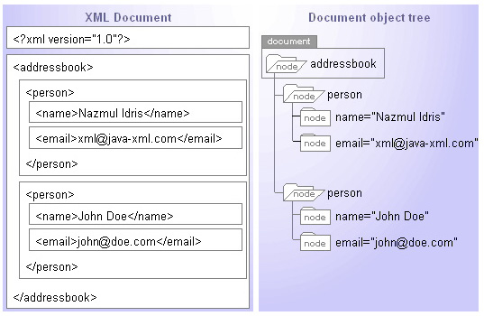
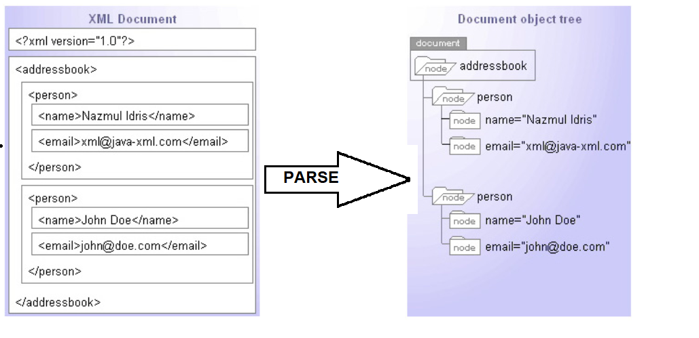
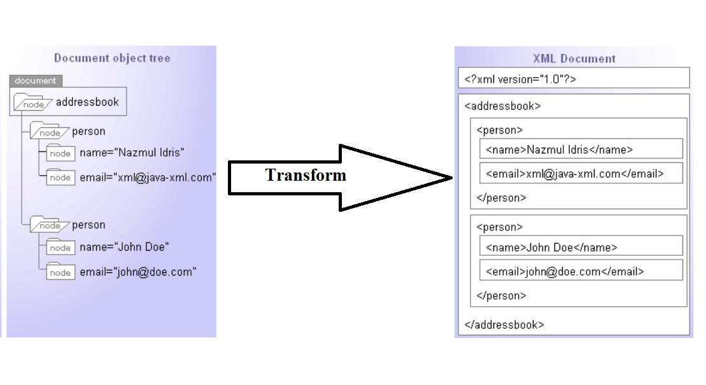
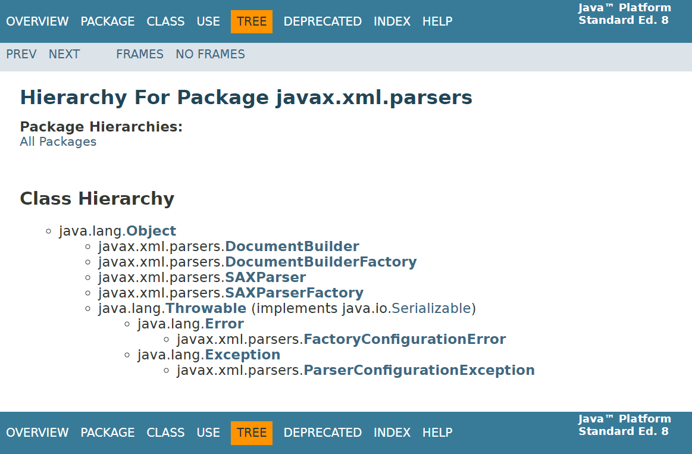
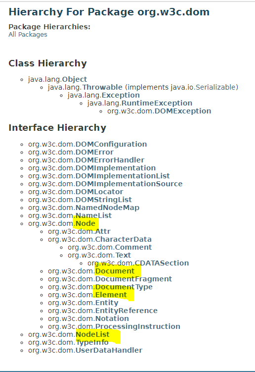
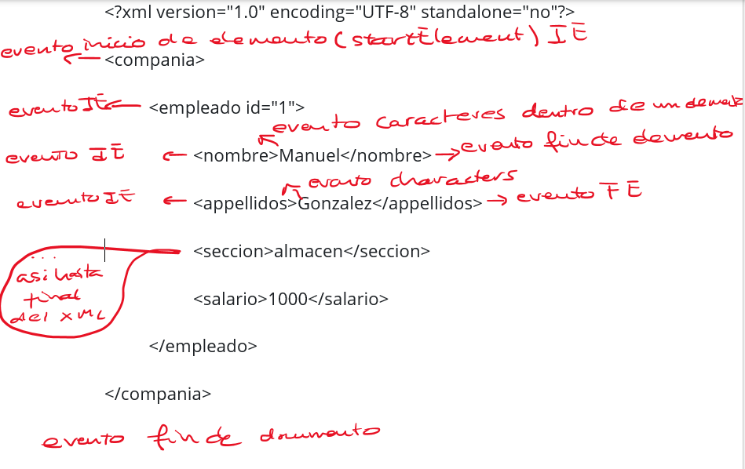
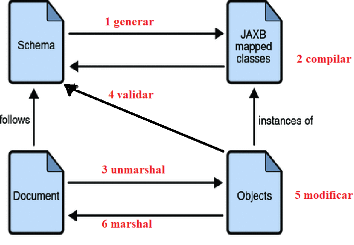
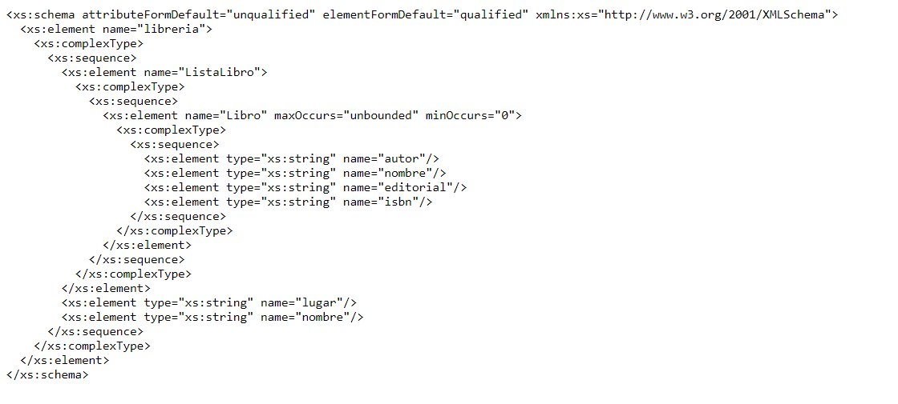
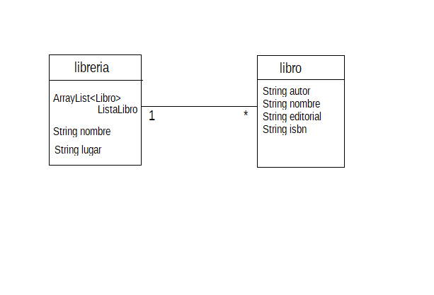
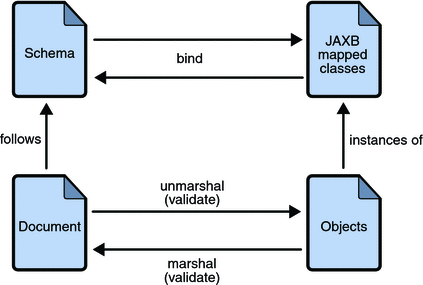

# UT02-B: Librerías de tratamiento de XML en Java

> **Módulo:** Acceso a Datos (DAM 2)
> **Unidad:** UT02 - Persistencia en ficheros y XML
> **Tema:** 2B - Librerías de tratamiento de XML en Java (DOM, SAX, StAX, JAXB)
> **Documento oficial PDF:** [`2B Librerías de tratamiento de XML en Java. _ AulaVirtual.pdf`](../recursos/2B%20Librer%C3%ADas%20de%20tratamiento%20de%20XML%20en%20Java.%20_%20AulaVirtual/2B%20Librer%C3%ADas%20de%20tratamiento%20de%20XML%20en%20Java.%20_%20AulaVirtual.pdf)
> **Versión web HTML:** [`2B Librerías de tratamiento de XML en Java. _ AulaVirtual.html`](../recursos/2B%20Librer%C3%ADas%20de%20tratamiento%20de%20XML%20en%20Java.%20_%20AulaVirtual/2B%20Librer%C3%ADas%20de%20tratamiento%20de%20XML%20en%20Java.%20_%20AulaVirtual.html)

---

## 1. Introducción

Cuando se quieren almacenar **datos que deban ser leídos por aplicaciones ejecutadas en múltiples plataformas**, es necesario recurrir a formatos estandarizados, como los lenguajes de marcas.

Los **documentos XML** consiguen **estructurar la información** intercalando una serie de **marcas denominadas etiquetas**. En XML, las marcas o etiquetas tienen cierta similitud con un contenedor de información. Así, **una etiqueta puede contener otras etiquetas o información textual**. De este modo, conseguiremos subdividir la información estructurándola de forma que pueda ser fácilmente interpretada.

XML es un formato de almacenamiento e intercambio de datos basado en texto estructurado mediante etiquetas. Los usos de XML son múltiples.

**Gran parte de la potencia de XML radica en el equilibrio entre ser un formato de texto sencillo y portable a cualquier plataforma, pero con la suficiente flexibilidad para representar información estructurada.** Esto nos permite utilizar XML para compartir información entre diferentes aplicaciones. Podemos acceder a información producida por una aplicación ajena e integrarla en nuestra propia aplicación de forma débilmente acoplada. De esta forma, utilizamos dentro de nuestra aplicación un servicio que nos proporciona otra aplicación que puede estar ubicada en cualquier lugar de Internet.

Además, no solo sirve para integrar aplicaciones ubicadas en distintos lugares de la red, sino que también permite comunicar aplicaciones implementadas en diferentes lenguajes y plataformas. Por ejemplo, podemos intercambiar datos.

Como **toda la información es textual**, no existe el problema de representar los datos de maneras diferentes. Cualquier dato, ya sea numérico o booleano, debe transcribirse como texto; así, cualquiera que sea el sistema de representación de datos, será posible leer e interpretar correctamente la información contenida en un archivo XML.

Es cierto que los caracteres **se pueden escribir usando también diferentes sistemas de codificación**, pero XML ofrece diversas técnicas para evitar que esto sea un problema. Por ejemplo, **es posible incluir en la cabecera del archivo qué codificación se ha utilizado durante el almacenamiento**; también se pueden representar caracteres mediante **entidades de caracteres**, una forma universal de codificar símbolos, incluidos aquellos que no pertenecen a ASCII.
XML permite organizar cualquier tipo de información de forma jerárquica. Es similar a cómo la información se guarda en los objetos de una aplicación y cómo se guardaría en un documento XML. La información, en las aplicaciones orientadas a objetos, se estructura, agrupa y jerarquiza en clases, y en los documentos XML se estructura, organiza y jerarquiza en etiquetas contenidas unas dentro de otras y atributos de las etiquetas. ([Consulta aquí librerías que permiten trabajar con XML desde Java](https://www.baeldung.com/java-xml-libraries)).

### 1.1. _Parser_ o analizador XML

Dado que XML es un lenguaje utilizado ampliamente en el desarrollo de la World Wide Web, existen ya herramientas y estándares de programación para leer documentos XML.

**Un _parser_ XML es un módulo, biblioteca o programa que se ocupa de analizar, clasificar y convertir un archivo XML en una representación interna, extrayendo la información contenida en cada una de las etiquetas y relacionándola de acuerdo con su posición en la jerarquía.**

En el caso de XML, como el formato siempre es el mismo, no necesitamos crear un _parser_ cada vez que hacemos un programa, sino que existe un gran número de _parsers_ o analizadores sintácticos disponibles que pueden averiguar si un documento XML cumple una determinada gramática. Estos analizadores pueden ser secuenciales, como SAX o StAX, o jerárquicos, como DOM.

**Analizadores secuenciales**

Los analizadores secuenciales **permiten extraer el contenido del XML a medida que encuentran las etiquetas de apertura y cierre**. Esto significa que **van leyendo el flujo de entrada y procesan los datos de forma inmediata**, sin tener que cargar todo el archivo en memoria. Este enfoque es eficiente para manejar grandes volúmenes de datos, ya que no requiere almacenar todo el documento, sino procesarlo a medida que se lee. Son analizadores muy rápidos, pero presentan la limitación de que, si se necesita acceder de nuevo a una parte del contenido, es necesario releer todo el documento de arriba abajo.

En Java hay dos analizadores secuenciales: **SAX**, que es el acrónimo de **Simple API for XML** (muy usado en diversas bibliotecas de tratamiento de datos XML, pero poco habitual en aplicaciones finales) y **StAX** (**Streaming API for XML**), posterior a SAX y que ofrece mayor control al programador.

**Analizadores jerárquicos**

Generalmente, las aplicaciones finales que necesitan trabajar con datos XML suelen usar **analizadores jerárquicos porque, además de realizar un análisis secuencial que permite clasificar el contenido, los [datos contenidos](<>) se almacenan en la memoria RAM siguiendo la estructura jerárquica detectada en el documento**. Esto facilita mucho las consultas que haya que repetir varias veces, dado que las estructuras jerárquicas en memoria RAM ofrecen un acceso muy eficiente a los datos.

**Los analizadores jerárquicos guardan todos los datos del XML en memoria dentro de una estructura jerárquica.** Son ideales para aplicaciones que requieran una consulta continua de los datos.

El formato de la estructura donde se almacena la información en la memoria RAM ha sido especificado por el organismo internacional W3C (World Wide Web Consortium) y se conoce como DOM (_Document Object Model_, modelo de objetos del documento).

HTML y JavaScript han popularizado mucho el estándar DOM. Se trata de una especificación que Java materializa en forma de interfaces. La principal se denomina **`Document`** y representa un documento XML completo. Al tratarse de una interfaz, puede ser implementada por varias clases.

**Comparativa de analizadores**

| CARACTERÍSTICA                 | StAX            | SAX             | DOM        | TrAX       |
| ------------------------------ | --------------- | --------------- | ---------- | ---------- |
| Tipo de API                    | Pull, streaming | Push, streaming | En memoria | Regla XSLT |
| Facilidad de uso               | Alta            | Media           | Alta       | Media      |
| Capacidad XPath                | No              | No              | Sí         | Sí         |
| Eficiencia de CPU y memoria    | Buena           | Buena           | Varía      | Varía      |
| Solo hacia adelante            | Sí              | Sí              | No         | No         |
| Lee XML                        | Sí              | Sí              | Sí         | Sí         |
| Escribe XML                    | Sí              | No              | Sí         | Sí         |
| Crear, leer, modificar, borrar | No              | No              | Sí         | No         |

[Para saber más](https://programacion.net/articulo/comparacion_de_las_tecnologias_java_para_xml_157)

### 1.2. DOM vs SAX

El analizador DOM es una API basada en la representación de la información mediante un árbol jerárquico. Proporciona interfaces para trabajar con el árbol completo (documento) o con una parte de este.
**Un analizador DOM crea una estructura de árbol en memoria del documento XML de entrada** y luego atiende las solicitudes del cliente. Un analizador DOM carga en memoria todo el documento XML, independientemente de si el cliente necesita solo una parte o el documento entero. Con el analizador DOM, las llamadas a métodos en la aplicación cliente permiten recorrer y consultar el árbol jerárquico.

**El analizador SAX es una API basada en eventos.** Por lo general, proporciona interfaces que deben ser implementadas por clases controladoras (_handlers_) para gestionar los eventos generados durante el análisis (como el hallazgo de etiquetas de apertura/cierre, texto o comentarios).
**El analizador SAX no crea un árbol interno del documento.** En cambio, notifica los componentes del documento de entrada como eventos en tiempo real mientras lee el flujo secuencialmente y procesa solo una parte del documento en cada momento.

**Resumiendo, las diferencias entre las API DOM y SAX:**

- DOM analiza documentos enteros.
- Representa el resultado como un árbol.
- Permite búsquedas en el árbol.
- Permite la modificación del árbol.
- Es adecuado para leer ficheros de datos/configuración.
- SAX analiza secuencialmente el documento XML de principio a fin, hasta que se le indica que pare.
- Dispara eventos por cada componente del documento que encuentra.

### 1.3. Serialización del XML

**La serialización es un mecanismo ampliamente usado para transportar objetos a través de una red, para hacer persistente un objeto en un archivo o base de datos, o para distribuir objetos idénticos a varias aplicaciones o localizaciones.**

XML es un formato estándar de documentos basados en texto que permite almacenar datos legibles por aplicaciones y procesarlos fácilmente. Para llevar a cabo este proceso, se deben definir mediante reglas tanto la transformación de objetos Java a XML como la transformación inversa.

Las librerías **`JAXB`** (Java Architecture for XML Binding) y **`XStream`** permiten serializar objetos Java en un medio de almacenamiento (archivo o búfer de memoria) con el fin de transmitirlos o almacenarlos en formatos legibles como XML o JSON. La serie de bytes o el formato empleado permiten reconstruir un nuevo objeto idéntico en su estado interno al original (un clon persistido).

## 2. DOM



María Jesús Lamarca Lapuente. _Hipertexto: El nuevo concepto de documento en la cultura de la imagen._

**DOM (Document Object Model)** es una recomendación oficial del World Wide Web Consortium (W3C). Define una interfaz estándar que permite a los programas acceder y actualizar el estilo, la estructura y el contenido de los documentos XML. Los analizadores XML compatibles con DOM implementan esta interfaz.

El módulo **`java.xml`** incluye las APIs necesarias para procesar y manipular documentos XML en Java. Esto incluye el soporte para DOM (Document Object Model), SAX (Simple API for XML) y XSLT (Extensible Stylesheet Language Transformations).

Incluye la clase abstracta **`DocumentBuilder`** con el propósito de poder instanciar estructuras DOM a partir de un XML. Recuerda que las clases abstractas no se pueden instanciar de forma directa; por este motivo se especifica la clase factoría **`DocumentBuilderFactory`**:

```java
DocumentBuilderFactory dbf = DocumentBuilderFactory.newInstance();
DocumentBuilder db = dbf.newDocumentBuilder();
```

#### Operaciones con DOM

A partir de aquí podemos leer el fichero XML y obtener un documento DOM que represente en memoria la información contenida en el XML (parseo). También podemos añadir nodos a este documento y después escribirlo en un fichero XML (transformación).

**Operación de parseo: XML → `Document`**



```java
Document doc = db.parse(new File("fitxer.xml"));
```

El método `parse()` lee el fichero XML y lo convierte en un documento de la interfaz `org.w3c.dom.Document` en memoria RAM. Para utilizar la información contenida en el árbol, emplearemos las interfaces de DOM: `Node`, `NodeList`, `Element`, etc. Lo veremos más adelante.

**Operación de transformación: `Document` → XML**



Se crea un documento (árbol DOM) vacío con el método `newDocument()` de la clase `DocumentBuilder`:

```java
Document doc = db.newDocument();
```

Para añadir nodos y subnodos con la información que queramos guardar en el fichero XML, utilizaremos las interfaces de DOM: `Node`, `NodeList`, `Element`, etc. Lo veremos más adelante.

La escritura de la información contenida en un documento DOM se puede secuenciar en forma de texto utilizando **`Transformer`**. Permite realizar conversiones jerárquicas, por ejemplo volcando un objeto `Document` a un archivo XML.

`Transformer` es también una clase abstracta y requiere de `TransformerFactory` para ser instanciada. Trabaja mediante un par de adaptadores: **`Source`** (origen: `DOMSource`, `SAXSource`, `StreamSource`) y **`Result`** (destino: `DOMResult`, `SAXResult`, `StreamResult`).

El código básico para transformar un DOM en un archivo de texto XML sería el siguiente:

```java
// Creación de una instancia de Transformer
Transformer trans = TransformerFactory.newInstance().newTransformer();
// Creación de los adaptadores Source y Result a partir de un Document y un File
StreamResult result = new StreamResult(file);
DOMSource source = new DOMSource(doc);
trans.transform(source, result);
```

### 2.1. Ejemplo de DOM

El siguiente ejemplo parsea un archivo XML (`cd_catalog.xml`) y lo transforma para volcarlo a un fichero de texto (`catalogo.txt`) o mostrarlo por pantalla:

```java
package ejemplo1;

import java.io.File;
import java.io.IOException;
import javax.xml.parsers.DocumentBuilderFactory;
import javax.xml.parsers.ParserConfigurationException;
import javax.xml.transform.OutputKeys;
import javax.xml.transform.Transformer;
import javax.xml.transform.TransformerException;
import javax.xml.transform.TransformerFactory;
import javax.xml.transform.dom.DOMSource;
import javax.xml.transform.stream.StreamResult;
import org.w3c.dom.Document;
import org.xml.sax.SAXException;

public class XmlCtrlDom {
    final static File ficheroIN = new File("cd_catalog.xml");
    final static File ficheroOUT = new File("catalogo.txt");

    public static void main(String[] args) throws SAXException, IOException, ParserConfigurationException, TransformerException {
        Document documento = null;
        // Parsear: ficheroIN -> documento DOM
        documento = instanciarDocument(ficheroIN);

        // Transformar: documento DOM -> ficheroOUT
        escribeDocumentATextXml(documento, ficheroOUT);
    }

    // Crea un documento DOM vacío
    public static Document instanciarDocument() throws ParserConfigurationException {
        Document doc = DocumentBuilderFactory.newInstance().newDocumentBuilder().newDocument();
        return doc;
    }

    // Lee un fichero XML y crea un documento DOM en memoria
    public static Document instanciarDocument(File fXmlFile) throws SAXException, IOException, ParserConfigurationException {
        Document doc = DocumentBuilderFactory.newInstance().newDocumentBuilder().parse(fXmlFile);
        return doc;
    }

    // Transforma un documento DOM en un fichero XML (o a consola)
    public static void escribeDocumentATextXml(Document doc, File file) throws TransformerException {
        Transformer trans = TransformerFactory.newInstance().newTransformer();
        trans.setOutputProperty(OutputKeys.INDENT, "yes");

        // StreamResult puede tener distintas salidas: a un fichero o por pantalla (System.out)
        StreamResult result = new StreamResult(file);
        DOMSource source = new DOMSource(doc);
        trans.transform(source, result);
    }
}
```

### 2.2. Jerarquía de clases del paquete `javax.xml.parsers`



[Jerarquía de clases e interfaces](https://docs.oracle.com/en/java/javase/11/docs/api/java.xml/javax/xml/parsers/package-tree.html) (Java SE 11)



Jerarquía de clases e interfaces del [paquete `org.w3c.dom`](https://docs.oracle.com/en/java/javase/11/docs/api/java.xml/org/w3c/dom/package-tree.html) (Java SE 11).

### 2.3. La estructura DOM

La estructura DOM toma la forma de un árbol, donde cada parte del XML se encontrará representada en forma de nodo.

En función de la posición en el documento XML, hablaremos de diferentes tipos de nodos:

- El nodo principal que representa todo el XML entero se denomina **`Document`**.
- Las diversas etiquetas, incluida la etiqueta raíz, se conocen como **nodos de tipo `Element`**.
- El contenido textual de una etiqueta se instancia como **nodo de tipo `Text`**.
- Los atributos se instancian como **nodos de tipo `Attr`**.

Cada nodo específico dispone de métodos para acceder a sus datos concretos (nombre, valor, nodos hijos, nodo padre, etc.).

El DOM resultante obtenido de un XML termina siendo una copia del archivo, pero con una disposición en árbol. Tanto el DOM como el XML tendrán información no visible, como los retornos de carro y los espacios en blanco, que debe tenerse en cuenta para procesar correctamente el contenido. Al mapear XML, los retornos de carro y la indentación suelen representarse en el DOM como nodos hijos de texto que contienen espacios en blanco, y **el contenido textual de las etiquetas se plasma en el DOM como un nodo hijo de la etiqueta contenedora**. Por tanto, para obtener el texto de una etiqueta simple se puede acceder a su primer nodo hijo.

La interfaz `Document` contempla un conjunto de métodos para seleccionar diferentes partes del árbol a partir del nombre de la etiqueta o de sus atributos. Las partes del árbol se devuelven como objetos `Element`, los cuales representan un nodo y todos sus hijos.

#### Interfaces DOM principales

- **`Node`**: Representa a cualquier nodo del documento. Es el tipo primario del que heredan el resto de interfaces.
- **`Element`**: Es un tipo de nodo específico asociado a una etiqueta XML.
- **`Attr`**: Representa un atributo de un elemento.
- **`Text`**: Contenido textual de un elemento.
- **`Document`**: Representa el documento XML completo (árbol DOM) y permite crear nuevos nodos.
- **`NodeList`**: Colección ordenada de nodos a los que se accede mediante un índice (`item(int index)`).

#### Métodos DOM más usuales

- **`Element Document.getDocumentElement()`**: Retorna el elemento raíz del documento.
- **`Node Node.getFirstChild()`**: Retorna el primer nodo hijo.
- **`Node Node.getLastChild()`**: Retorna el último nodo hijo.
- **`Node Node.getNextSibling()`**: Retorna el siguiente nodo hermano.
- **`Node Node.getPreviousSibling()`**: Retorna el nodo hermano anterior.
- **`String Element.getAttribute(String name)`**: Retorna el valor del atributo cuyo nombre se pasa como argumento.
- **`String Node.getNodeValue()`**: Retorna el valor del nodo (para nodos de texto o atributos).
- **`NodeList Element.getElementsByTagName(String name)`**: Devuelve un `NodeList` con todos los descendientes con ese nombre de etiqueta.
- **`NodeList Document.getElementsByTagName(String name)`**: Devuelve un `NodeList` con todos los elementos del documento con ese nombre.
- **`Node NodeList.item(int i)`**: Recupera el nodo en la posición `i` de la lista.

Para facilitar la obtención del contenido de un `Element`, podemos implementar métodos auxiliares:

```java
public static String getValorEtiqueta(String etiqueta, Element elemento) {
    Node nValue = elemento.getElementsByTagName(etiqueta).item(0);
    return nValue.getTextContent();
}

public static Element getElementEtiqueta(String etiqueta, Element elemento) {
    return (Element) elemento.getElementsByTagName(etiqueta).item(0);
}
```

- **`getValorEtiqueta`**: Recibe el nombre de la etiqueta y el elemento a partir del cual se desea realizar la búsqueda. Devuelve el contenido textual del elemento. Mediante `getElementsByTagName` obtenemos la lista de nodos coincidentes y con `.item(0)` tomamos el primero.
- **`getElementEtiqueta`**: Similar al anterior, pero en vez de recuperar el texto, devuelve el objeto `Element` con todos sus posibles hijos. Es útil para nodos compuestos intermedios.

Los objetos `Element` disponen de métodos para añadir nuevos hijos (`appendChild`) o asignar el valor a un atributo (`setAttribute`). La creación de nuevos elementos se realiza mediante el objeto `Document` (`createElement`, `createTextNode`, `createComment`). La creación de nodos no implica su ubicación en el árbol: tras crearlos deben agregarse a un nodo padre mediante `appendChild`.

### 2.4. Ejemplo completo


El ejemplo siguiente muestra cómo utilizar DOM para analizar y extraer información de un fichero XML.

Listamos la información contenida en el documento `clase.xml`:

**`clase.xml`**

```xml
<?xml version="1.0" encoding="UTF-8"?>
<clase>
    <alumno numero="393">
        <nombre>Luis</nombre>
        <apellido>Luna</apellido>
        <apodo>Na</apodo>
        <marcas>85</marcas>
    </alumno>
    <alumno numero="493">
        <nombre>Antonio</nombre>
        <apellido>Alvarez</apellido>
        <apodo>Avez</apodo>
        <marcas>95</marcas>
    </alumno>
    <alumno numero="593">
        <nombre>Juan</nombre>
        <apellido>Juz</apellido>
        <apodo>jazz</apodo>
        <marcas>90</marcas>
    </alumno>
</clase>
```

Los pasos a seguir son los siguientes:

1. **Importar los paquetes necesarios.**
2. **Construir un documento DOM en memoria a partir del fichero XML.**
3. **Extraer el elemento raíz.**
4. **Examinar los atributos.**
5. **Examinar los subelementos.**

El código correspondiente a estos pasos es el siguiente:

```java
import java.io.*;
import javax.xml.parsers.*;
import org.w3c.dom.*;

public class PasosDOM {
    public static void main(String[] args) throws Exception {
        DocumentBuilderFactory factory = DocumentBuilderFactory.newInstance();
        DocumentBuilder builder = factory.newDocumentBuilder();
        Document document = builder.parse(new File("clase.xml")); // Construye el árbol en memoria

        Element root = document.getDocumentElement();
        Element element = (Element) document.getElementsByTagName("alumno").item(0);

        // Devuelve el valor de un atributo específico
        String attr = element.getAttribute("numero");
        // Devuelve el NamedNodeMap con todos los atributos
        NamedNodeMap attrs = element.getAttributes();

        // Devuelve una lista con todos los subelementos coincidentes
        NodeList lista = element.getElementsByTagName("nombre");
        // Devuelve una lista con todos los nodos hijos
        NodeList hijos = element.getChildNodes();
    }
}
```

**Programa completo (`Ejemplo2.java`):**

```java
import java.io.File;
import javax.xml.parsers.DocumentBuilder;
import javax.xml.parsers.DocumentBuilderFactory;
import org.w3c.dom.Document;
import org.w3c.dom.Element;
import org.w3c.dom.Node;
import org.w3c.dom.NodeList;

public class Ejemplo2 {
    public static void main(String[] args) {
        try {
            File inputFile = new File("clase.xml");
            DocumentBuilderFactory dbFactory = DocumentBuilderFactory.newInstance();
            DocumentBuilder dBuilder = dbFactory.newDocumentBuilder();
            Document doc = dBuilder.parse(inputFile);
            doc.getDocumentElement().normalize();

            System.out.println("Root element: " + doc.getDocumentElement().getNodeName());
            NodeList nList = doc.getElementsByTagName("alumno");
            System.out.println("----------------------------");

            for (int temp = 0; temp < nList.getLength(); temp++) {
                Node nNode = nList.item(temp);
                System.out.println("\nCurrent Element: " + nNode.getNodeName());

                if (nNode.getNodeType() == Node.ELEMENT_NODE) {
                    Element eElement = (Element) nNode;
                    System.out.println("Número de alumno: " + eElement.getAttribute("numero"));
                    System.out.println("Nombre: " + eElement.getElementsByTagName("nombre").item(0).getTextContent());
                    System.out.println("Apellido: " + eElement.getElementsByTagName("apellido").item(0).getTextContent());
                    System.out.println("Apodo: " + eElement.getElementsByTagName("apodo").item(0).getTextContent());
                    System.out.println("Marcas: " + eElement.getElementsByTagName("marcas").item(0).getTextContent());
                }
            }
        } catch (Exception e) {
            e.printStackTrace();
        }
    }
}
```

El método `normalize()` unifica nodos de texto adyacentes y elimina nodos de texto vacíos en el árbol DOM.

### 2.5. Creación de un fichero XML a partir de un documento


La escritura de la información contenida en el DOM se puede secuenciar en forma de texto utilizando **`Transformer`**. Es capaz de pasar la información contenida en un objeto `Document` a un archivo de texto en formato XML.

`Transformer` es una clase abstracta y requiere de `TransformerFactory` para ser instanciada. Trabaja con adaptadores de origen (`Source`) y destino (`Result`):

- **Orígenes:** `DOMSource`, `SAXSource`, `StreamSource`.
- **Destinos:** `DOMResult`, `SAXResult`, `StreamResult`.

Los pasos para construir un documento DOM desde cero y guardarlo en XML son:

1. **Instanciar el documento DOM en memoria.**
2. **Crear el nodo raíz y añadirlo al documento.**
3. **Crear elementos hijos, textos y atributos.**
4. **Crear una instancia de `Transformer`.**
5. **Configurar los adaptadores `DOMSource` y `StreamResult`.**
6. **Convertir el árbol DOM en el fichero XML.**

El código correspondiente a estos pasos es el siguiente:

```java
import java.io.File;
import javax.xml.parsers.DocumentBuilder;
import javax.xml.parsers.DocumentBuilderFactory;
import javax.xml.transform.Transformer;
import javax.xml.transform.TransformerFactory;
import javax.xml.transform.dom.DOMSource;
import javax.xml.transform.stream.StreamResult;
import org.w3c.dom.Attr;
import org.w3c.dom.Document;
import org.w3c.dom.Element;

public class PasosCrearXML {
    public static void main(String[] args) throws Exception {
        DocumentBuilderFactory docFactory = DocumentBuilderFactory.newInstance();
        DocumentBuilder docBuilder = docFactory.newDocumentBuilder();
        Document doc = docBuilder.newDocument();

        Element rootElement = doc.createElement("compania");
        doc.appendChild(rootElement);

        Element empleado = doc.createElement("empleado");
        rootElement.appendChild(empleado);

        Attr attr = doc.createAttribute("id");
        attr.setValue("1");
        empleado.setAttributeNode(attr);

        Element nombre = doc.createElement("nombre");
        nombre.appendChild(doc.createTextNode("Manuel"));
        empleado.appendChild(nombre);

        TransformerFactory transformerFactory = TransformerFactory.newInstance();
        Transformer transformer = transformerFactory.newTransformer();

        DOMSource source = new DOMSource(doc);
        StreamResult result = new StreamResult(new File("archivo.xml"));
        transformer.transform(source, result);
    }
}
```

**Ejemplo completo: Creación de `archivo.xml`**

Se desea generar un archivo XML con el siguiente contenido:

```xml
<?xml version="1.0" encoding="UTF-8" standalone="no"?>
<compania>
    <empleado id="1">
        <nombre>Manuel</nombre>
        <apellidos>González</apellidos>
        <seccion>almacén</seccion>
        <salario>1000</salario>
    </empleado>
</compania>
```

**Código Java (`WriteXMLFile.java`):**

```java
import java.io.File;
import javax.xml.parsers.DocumentBuilder;
import javax.xml.parsers.DocumentBuilderFactory;
import javax.xml.parsers.ParserConfigurationException;
import javax.xml.transform.Transformer;
import javax.xml.transform.TransformerException;
import javax.xml.transform.TransformerFactory;
import javax.xml.transform.dom.DOMSource;
import javax.xml.transform.stream.StreamResult;
import org.w3c.dom.Attr;
import org.w3c.dom.Document;
import org.w3c.dom.Element;

public class WriteXMLFile {
    public static void main(String[] args) {
        try {
            DocumentBuilderFactory docFactory = DocumentBuilderFactory.newInstance();
            DocumentBuilder docBuilder = docFactory.newDocumentBuilder();

            // Elemento raíz
            Document doc = docBuilder.newDocument();
            Element rootElement = doc.createElement("compania");
            doc.appendChild(rootElement);

            // Elemento empleado
            Element empleado = doc.createElement("empleado");
            rootElement.appendChild(empleado);

            // Atributo del elemento empleado
            Attr attr = doc.createAttribute("id");
            attr.setValue("1");
            empleado.setAttributeNode(attr);

            // Subnodo nombre
            Element nombre = doc.createElement("nombre");
            nombre.appendChild(doc.createTextNode("Manuel"));
            empleado.appendChild(nombre);

            // Subnodo apellidos
            Element apellidos = doc.createElement("apellidos");
            apellidos.appendChild(doc.createTextNode("González"));
            empleado.appendChild(apellidos);

            // Subnodo sección
            Element seccion = doc.createElement("seccion");
            seccion.appendChild(doc.createTextNode("almacén"));
            empleado.appendChild(seccion);

            // Subnodo salario
            Element salario = doc.createElement("salario");
            salario.appendChild(doc.createTextNode("1000"));
            empleado.appendChild(salario);

            // Escribimos el contenido en un archivo .xml
            TransformerFactory transformerFactory = TransformerFactory.newInstance();
            Transformer transformer = transformerFactory.newTransformer();
            DOMSource source = new DOMSource(doc);
            StreamResult result = new StreamResult(new File("archivo.xml"));

            // Para mostrar por consola en lugar de archivo:
            // StreamResult result = new StreamResult(System.out);

            transformer.transform(source, result);
            System.out.println("Fichero guardado exitosamente.");
        } catch (ParserConfigurationException pce) {
            pce.printStackTrace();
        } catch (TransformerException tfe) {
            tfe.printStackTrace();
        }
    }
}
```

## 3. SAX

**SAX** es un estándar de parseo de XML. El estándar SAX (_Simple API for XML_) procesa el documento o información en XML de una manera muy diferente a DOM: **SAX procesa la información por eventos**.

A diferencia de DOM, que genera un árbol jerárquico en memoria, **SAX procesa la información en XML conforme va siendo leída (evento por evento)**, manipulando cada elemento secuencialmente sin incurrir en un uso excesivo de memoria.

**SAX** es un analizador (_parser_) ideal para **manipular archivos de gran tamaño**, ya que consume poca memoria al no generar el árbol que requiere DOM. Es más rápido y consume menos memoria, pero **realiza una lectura estrictamente secuencial**, por lo que una vez leído un fragmento **no se puede volver atrás** (a diferencia de DOM). Además, DOM permite leer (_parse_) y escribir (_transform_), mientras que SAX es únicamente de lectura. En SAX no hay forma automática de navegar por las relaciones padre/hijo: es responsabilidad del programador gestionar el estado y la jerarquía.

**Se recomienda utilizar SAX cuando:**

- Queremos parsear el documento XML una sola vez.
- Queremos parsear partes del documento XML (capturamos los eventos importantes).
- No se requiere una modificación estructural.
- Se procesan archivos XML grandes.

**Características**

- Detecta cuándo empiezan y terminan un elemento, el documento o un conjunto de caracteres, entre otros componentes (genera eventos).
- Gestiona los espacios de nombres.
- Comprueba que el documento está bien formado.
- Las aplicaciones necesitan implementar manejadores de los eventos notificados.
- SAX lee secuencialmente de principio a fin, sin cargar todo el documento en memoria.

**El paquete necesario para analizar ficheros XML con SAX es `javax.xml.parsers`**. Puedes consultarlo en la [documentación](https://docs.oracle.com/en/java/javase/11/docs/api/java.xml/javax/xml/parsers/package-summary.html).

Las clases principales que necesitaremos son **`SAXParser`** y **`SAXParserFactory`**. Para trabajar con eventos se utilizan las interfaces del paquete **`org.xml.sax`** (consultar [documentación](https://docs.oracle.com/en/java/javase/11/docs/api/java.xml/org/xml/sax/package-summary.html)).

**La clase `org.xml.sax.helpers.DefaultHandler` es el manejador genérico** de ficheros XML. Esta clase permite implementar las acciones que debe realizar el analizador.

Responde a eventos, por lo que se llamará a los métodos especificados cuando suceda algo en concreto. Los métodos principales de esta clase son:

- **`startDocument`**: Se invoca cuando se detecta que el documento empieza. Aquí deben indicarse las acciones que se realizarán al inicio del documento.
- **`endDocument`**: Se invoca cuando se detecta que el documento ha acabado. Por lo tanto, aquí deben indicarse las acciones que se realizarán al finalizar el documento.
- **`startElement`**: Se invoca cuando se encuentra un nuevo elemento, nodo o etiqueta. Aquí debe indicarse el tratamiento que se realizará sobre cada nuevo elemento, como la recogida de información de sus atributos.
- **`endElement`**: Se invoca cuando se ha leído el elemento. Aquí puede tratarse la información del nodo y de su contenido.
- **`characters`**: Se invoca cuando se encuentra texto dentro de las etiquetas.

### 3.1. ¿Cómo funciona SAX?

Los analizadores SAX se basan en un modelo de **eventos**: a medida que el _parser_ recorre el documento, informa de los eventos que se producen (como el comienzo de un elemento XML o el final del documento) a un objeto manejador de eventos (_event handler_).

#### ¿Cómo funcionan los manejadores de eventos?

El _parser_ SAX procesa un documento XML analizándolo secuencialmente de arriba abajo. SAX detecta eventos (inicio y fin de etiqueta, inicio y fin del documento, contenido textual de un nodo, etc.):



El siguiente programa utiliza SAX para analizar un fichero XML utilizando el manejador por defecto (`DefaultHandler`):

```java
import java.io.File;
import javax.xml.parsers.SAXParser;
import javax.xml.parsers.SAXParserFactory;
import org.xml.sax.helpers.DefaultHandler;

public class Ejemplo1 {
    public static void main(String[] args) throws Exception {
        SAXParserFactory factory = SAXParserFactory.newInstance();
        SAXParser saxParser = factory.newSAXParser();

        saxParser.parse(new File("menu.xml"), new DefaultHandler());
    }
}
```

1. Se crea el objeto de la clase `SAXParser` a partir de `SAXParserFactory`:

```java
SAXParserFactory factory = SAXParserFactory.newInstance();
SAXParser saxParser = factory.newSAXParser();
```

2. A partir del analizador, se invoca `parse(File, Handler)` pasando el manejador que procesará los eventos.

Para que nuestro programa procese la información, extenderemos `DefaultHandler` y sobrescribiremos los métodos necesarios:

1. **`startDocument()`**: Se invoca al principio del documento XML.
2. **`endDocument()`**: Se invoca al final del documento XML.
3. **`startElement(String uri, String localName, String qName, Attributes atts)`**: Se invoca al comienzo de un elemento.
4. **`endElement(String uri, String localName, String qName)`**: Se invoca al final de un elemento.
5. **`characters(char[] ch, int start, int length)`**: Se invoca cuando se encuentran datos de texto entre las etiquetas inicial y final.

[Tutorial SAX en w3schools](https://www.w3schools.blog/sax-xml-parser-in-java-tutorial-example)

### 3.2. Cómo leer un archivo XML con SAX

El proceso de análisis con SAX se estructura en los siguientes pasos:

1. **Instanciar el procesador SAX y el manejador personalizado:**

```java
File inputFile = new File("input.xml");
SAXParserFactory factory = SAXParserFactory.newInstance();
SAXParser saxParser = factory.newSAXParser();

// UserHandler extiende DefaultHandler con los métodos para detectar eventos
UserHandler userHandler = new UserHandler();
saxParser.parse(inputFile, userHandler);
```

2. **Sobrescribir los métodos según la lógica deseada:**

```java
@Override
public void startElement(String uri, String localName, String qName, Attributes attributes) throws SAXException {
    // Procesar etiqueta de inicio
}

@Override
public void endElement(String uri, String localName, String qName) throws SAXException {
    // Procesar etiqueta de fin
}

@Override
public void characters(char[] ch, int start, int length) throws SAXException {
    // Procesar texto
}
```

**Documento XML de entrada (`input.xml`):**

```xml
<?xml version="1.0"?>
<class>
    <student rollno="393">
        <firstname>dinkar</firstname>
        <lastname>kad</lastname>
        <nickname>dinkar</nickname>
        <marks>85</marks>
    </student>

    <student rollno="493">
        <firstname>Vaneet</firstname>
        <lastname>Gupta</lastname>
        <nickname>vinni</nickname>
        <marks>95</marks>
    </student>

    <student rollno="593">
        <firstname>jasvir</firstname>
        <lastname>singn</lastname>
        <nickname>jazz</nickname>
        <marks>90</marks>
    </student>
</class>
```

**Programa Java completo (`SAXParserDemo.java`):**

```java
import java.io.File;
import javax.xml.parsers.SAXParser;
import javax.xml.parsers.SAXParserFactory;
import org.xml.sax.Attributes;
import org.xml.sax.SAXException;
import org.xml.sax.helpers.DefaultHandler;

public class SAXParserDemo {
    public static void main(String[] args) {
        try {
            File inputFile = new File("input.xml");
            SAXParserFactory factory = SAXParserFactory.newInstance();
            SAXParser saxParser = factory.newSAXParser();
            UserHandler userHandler = new UserHandler();
            saxParser.parse(inputFile, userHandler);
        } catch (Exception e) {
            e.printStackTrace();
        }
    }
}

class UserHandler extends DefaultHandler {
    private String currentElement;
    private final StringBuilder text = new StringBuilder();

    @Override
    public void startElement(String uri, String localName, String qName, Attributes attributes) throws SAXException {
        currentElement = qName;
        text.setLength(0);

        if (qName.equalsIgnoreCase("student")) {
            String rollNo = attributes.getValue("rollno");
            System.out.println("Roll No: " + rollNo);
        }
    }

    @Override
    public void endElement(String uri, String localName, String qName) throws SAXException {
        String value = text.toString().trim();
        if (qName.equalsIgnoreCase("firstname")) {
            System.out.println("First Name: " + value);
        } else if (qName.equalsIgnoreCase("lastname")) {
            System.out.println("Last Name: " + value);
        } else if (qName.equalsIgnoreCase("nickname")) {
            System.out.println("Nick Name: " + value);
        } else if (qName.equalsIgnoreCase("marks")) {
            System.out.println("Marks: " + value);
        } else if (qName.equalsIgnoreCase("student")) {
            System.out.println("End Element: " + qName);
        }
        currentElement = null;
        text.setLength(0);
    }

    @Override
    public void characters(char[] ch, int start, int length) throws SAXException {
        if (currentElement != null) {
            text.append(ch, start, length);
        }
    }
}
```

_(Fuente del ejemplo: tutorialspoint)_

Al ejecutarlo obtenemos como salida:

```text
Roll No: 393
First Name: dinkar
Last Name: kad
Nick Name: dinkar
Marks: 85
End Element: student

Roll No: 493
First Name: Vaneet
Last Name: Gupta
Nick Name: vinni
Marks: 95
End Element: student

Roll No: 593
First Name: jasvir
Last Name: singn
Nick Name: jazz
Marks: 90
End Element: student
```

Para analizar un archivo XML que contiene caracteres especiales UTF-8, es necesario especificar la codificación en el origen de datos que se va a parsear:

```java
File file = new File("c:\\file-utf.xml");
InputStream inputStream = new FileInputStream(file);
Reader reader = new InputStreamReader(inputStream, "UTF-8");
InputSource is = new InputSource(reader);
is.setEncoding("UTF-8");

saxParser.parse(is, handler);
```

## 4. StAX

**StAX** es una API basada en Java para analizar documentos XML de forma similar a como lo hace el analizador SAX, pero con dos diferencias fundamentales:

- **StAX es una API _pull_, mientras que SAX es una API _push_:** en StAX, la aplicación cliente solicita activamente (_tira de_) los eventos cuando los necesita. En SAX, el analizador notifica activamente (_empuja_) los eventos a la aplicación mediante funciones de retrollamada (_callbacks_).
- **StAX permite leer y escribir documentos XML**, mientras que SAX es exclusivamente de lectura.

**StAX consta realmente de dos API distintas:**

- **API de cursor:** representa un cursor con el que se puede avanzar por un documento XML desde el principio hasta el final. Este cursor puede **apuntar a un elemento cada vez** y siempre se mueve hacia delante, nunca hacia atrás.
- **API de iteradores:** representa el flujo de un documento XML como un conjunto **de objetos de eventos discretos**. La aplicación obtiene estos eventos en el mismo orden en que los proporciona el _parser_ al leer el documento XML. En cada paso de la iteración se obtiene un objeto `XMLEvent`, que contiene información sobre el evento generado durante la lectura. Mediante la referencia a este objeto, podemos extraer dicha información con los métodos que proporciona esta interfaz.

Una de las principales diferencias entre ambos estilos es que la API de iteradores materializa cada evento como un objeto `XMLEvent`, mientras que la API de cursor expone directamente la información del evento actual. Ambas avanzan hacia delante; ninguna permite retroceder por sí sola una vez consumido un evento, aunque con la API de iteradores la aplicación puede guardar los objetos recibidos para consultarlos después. La API de cursor es más eficiente en cuanto a memoria, por lo que la elección del estilo dependerá de las necesidades.

### 4.1. Características

Las siguientes son las características de la API StAX:

- Lee un documento XML de arriba a abajo, reconociendo los tokens que componen un documento XML bien formado.
- Los tokens se procesan en el mismo orden en que aparecen en el documento.
- Informa al programa de aplicación la naturaleza de los tokens que el analizador ha encontrado a medida que ocurren.
- El procesamiento se realiza utilizando iteradores o cursores.
- En el caso del procesamiento mediante iteradores, el programa de aplicación proporciona un lector de "eventos" que actúa como un iterador e itera sobre el evento para obtener la información requerida.
- En el caso del procesamiento con cursores, se crea un "cursor" que actúa como un puntero a los nodos XML.
- A medida que se identifican los eventos, los elementos XML pueden recuperarse del objeto de evento y pueden procesarse más.

**Debemos usar un analizador StAX cuando:**

- Se puede procesar el documento XML linealmente, de arriba abajo.
- El documento no está profundamente anidado.
- Se está procesando un documento XML muy grande cuyo árbol DOM consumiría demasiada memoria. Las implementaciones DOM típicas usan diez bytes de memoria para representar un byte de XML.
- El problema a resolver involucra solo una parte del documento XML.
- Los datos están disponibles tan pronto como el analizador los ve, por lo que StAX funciona bien con un documento XML que llega a través de un flujo.

Para poder utilizar las clases e interfaces de ambas API necesitamos un origen de datos XML válido. Esto lo conseguimos con la factoría **`XMLInputFactory`**:

```java
XMLInputFactory xmlif = XMLInputFactory.newInstance();
XMLStreamReader xmlsr = xmlif.createXMLStreamReader(new FileReader("books.xml"));
```

O bien utilizando un flujo de entrada `FileInputStream`:

```java
XMLInputFactory inputFactory = XMLInputFactory.newInstance();
InputStream in = new FileInputStream("books.xml");
```

Como indicábamos anteriormente, StAX consta de dos API: lectores de cursor y lectores de eventos mediante iteradores.

---

#### Funcionamiento de StAX

El analizador crea diferentes tipos de eventos a medida que avanza leyendo el documento XML de origen.

Algunos de los tipos de eventos importantes son:

- Inicio del documento.
- Inicio de un elemento.
- Comentarios.
- Caracteres.
- Fin de un elemento.
- Fin del documento.

Aspectos importantes:

- Los eventos se crean en el orden en que se encuentran los componentes XML correspondientes en el documento, incluida la anidación de elementos, la apertura y el cierre de elementos, el orden de los atributos, el inicio del documento y su final.
- De acuerdo con la sintaxis XML, todos los elementos contenedores tienen los correspondientes eventos de inicio y fin; por ejemplo, cada `StartElement` tiene un `EndElement` correspondiente, incluso en los elementos vacíos.
- Los atributos se tratan como información asociada y se accede a ellos desde su evento `StartElement` correspondiente.
- De forma similar a los atributos, los espacios de nombres se tratan como información asociada y son accesibles desde los eventos `StartElement` y `EndElement` correspondientes.
- Los eventos de caracteres representan el contenido textual de los elementos. Un fragmento de texto puede dividirse en varios eventos de caracteres.
- El analizador StAX mantiene una pila de espacios de nombres que contiene información sobre todos los espacios de nombres XML definidos para el elemento actual y sus antecesores. Se puede acceder a la pila, expuesta mediante la interfaz `javax.xml.namespace.NamespaceContext`, a través del prefijo del espacio de nombres o del URI.

Para obtener más información, consulta este [enlace](https://biblus.us.es/bibing/proyectos/abreproy/11416/fichero/MEMORIA_EDITOR_FORMATO_QTI%252FCap%C3%ADtulo+2+Introducci%C3%B3n+a+XML.pdf+).

### 4.2. API de cursor

Como indica su nombre, la API de cursor representa un cursor con el que se puede recorrer un documento XML desde el principio hasta el final. Este cursor apunta a un elemento en cada momento y siempre avanza hacia delante, nunca hacia atrás.

Las dos interfaces principales son `XMLStreamReader` y `XMLStreamWriter`. El primero incluye métodos para extraer toda la información del modelo XML: codificación, nombres de elementos, atributos, espacios de nombres, nodos de texto, etiquetas de apertura, comentarios, instrucciones de procesado, etc.

El siguiente programa muestra cómo utilizar un cursor para recorrer un documento XML. Partiendo del documento XML `books.xml`, listamos los títulos de los libros.

**`books.xml`**

```xml
<bookstore>
    <book category="cooking">
        <title lang="en">Everyday Italian</title>
        <author>Giada De Laurentiis</author>
        <year>2005</year>
        <price>30.00</price>
    </book>
    <book category="children">
        <title lang="en">Harry Potter</title>
        <author>J K. Rowling</author>
        <year>2005</year>
        <price>29.99</price>
    </book>
    <book category="web">
        <title lang="en">XQuery Kick Start</title>
        <author>James McGovern</author>
        <author>Per Bothner</author>
        <author>Kurt Cagle</author>
        <author>James Linn</author>
        <author>Vaidyanathan Nagarajan</author>
        <year>2003</year>
        <price>49.99</price>
    </book>
    <book category="web" cover="paperback">
        <title lang="en">Learning XML</title>
        <author>Erik T. Ray</author>
        <year>2003</year>
        <price>39.95</price>
    </book>
</bookstore>
```

**Programa Java (`ListaLibrosStAX.java`):**

```java
package ejemplos;

import java.io.FileInputStream;
import java.io.FileNotFoundException;
import javax.xml.stream.XMLInputFactory;
import javax.xml.stream.XMLStreamException;
import javax.xml.stream.XMLStreamConstants;
import javax.xml.stream.XMLStreamReader;

public class ListaLibrosStAX {
    public static void main(String[] args) throws FileNotFoundException, XMLStreamException {
        // Creamos el flujo
        XMLInputFactory xmlif = XMLInputFactory.newInstance();
        XMLStreamReader xmlsr = xmlif.createXMLStreamReader(new FileInputStream("books.xml"));
        String tag = null;
        int eventType;

        System.out.println("Lista de libros");
        // Iteramos con el cursor a lo largo del documento
        while (xmlsr.hasNext()) {
            eventType = xmlsr.next();
            switch (eventType) {
                case XMLStreamConstants.START_ELEMENT:
                    tag = xmlsr.getName().getLocalPart();
                    System.out.println(tag);
                    if (tag.equals("title")) {
                        System.out.println("Idioma: " + xmlsr.getAttributeValue(null, "lang"));
                        System.out.println("Título: " + xmlsr.getElementText());
                    }
                    break;
                case XMLStreamConstants.END_DOCUMENT:
                    System.out.println("Fin del documento");
                    break;
            }
        }
    }
}
```

### 4.3. API de iteradores

La API de iteradores de StAX representa el flujo de un documento XML como un conjunto de objetos de eventos discretos. La aplicación consume estos eventos y el analizador los proporciona en el orden en que los lee en el documento XML de origen.

La interfaz base se llama `XMLEvent` y existen subinterfaces para cada tipo de evento definido (comienzo o fin de elemento, atributo, caracteres, etc.). La interfaz principal para leer eventos mediante un iterador es `XMLEventReader`, que contiene métodos como `nextEvent()` para devolver el siguiente evento. `XMLEventReader` extiende `java.util.Iterator`, lo que permite utilizar las operaciones habituales de un iterador de Java.

Utilizamos el mismo documento `books.xml` para iterar sobre los eventos:

```java
package ejemplos;

import java.io.FileInputStream;
import java.io.FileNotFoundException;
import java.io.InputStream;
import java.util.Iterator;
import javax.xml.namespace.QName;
import javax.xml.stream.XMLEventReader;
import javax.xml.stream.XMLInputFactory;
import javax.xml.stream.XMLStreamConstants;
import javax.xml.stream.XMLStreamException;
import javax.xml.stream.events.Attribute;
import javax.xml.stream.events.StartElement;
import javax.xml.stream.events.XMLEvent;

public class EventReader {
    public static void main(String[] args) {
        try (InputStream in = new FileInputStream("books.xml")) {
            XMLEventReader eventReader = XMLInputFactory.newInstance().createXMLEventReader(in);
            // Bucle que recorre todos los eventos del flujo
            while (eventReader.hasNext()) {
                XMLEvent event = eventReader.nextEvent();

                // Si el evento es el inicio del elemento "title"
                if (event.getEventType() == XMLStreamConstants.START_ELEMENT) {
                    StartElement startElement = event.asStartElement();
                    if ("title".equals(startElement.getName().getLocalPart())) {
                        // Iterar atributos del elemento title
                        Iterator<Attribute> iterator = startElement.getAttributes();
                        while (iterator.hasNext()) {
                            Attribute attribute = iterator.next();
                            QName name = attribute.getName();
                            String value = attribute.getValue();
                            System.out.println("Atributo name/valor: " + name + "/" + value);
                        }
                        System.out.println("Título: " + eventReader.getElementText());
                    }
                } else if (event.getEventType() == XMLStreamConstants.END_DOCUMENT) {
                    System.out.println("Fin del documento");
                }
            }
        } catch (FileNotFoundException | XMLStreamException e) {
            e.printStackTrace();
        } catch (java.io.IOException e) {
            e.printStackTrace();
        }
    }
}
```

## 5. Enlace de datos XML

El enlace de datos XML (_XML data binding_) se refiere al proceso de enlazar la información contenida en un documento XML con objetos Java en la memoria del ordenador.

Esto permite a las aplicaciones acceder a los datos en el XML desde el objeto en lugar de usar DOM o SAX para recuperar los datos desde una representación directa del XML en sí.

Un enlazador de datos XML logra esto mediante la creación automática de una correspondencia entre los elementos del esquema XML del documento que queremos enlazar y las clases de enlace (de mapeo).

En Java existen varias bibliotecas para gestionar el _binding_, como JAXB, JiBX o XMLBinding, entre otras. Desde Java SE 6 hasta Java SE 8, el JDK estándar incorporó JAXB, una potente biblioteca. A partir de Java 9 se marcó como módulo obsoleto y, desde Java 11, debe añadirse al proyecto como dependencia externa. Los ejemplos siguientes utilizan los paquetes `javax.xml.bind` de JAXB 2; Jakarta XML Binding 3 y versiones posteriores emplean `jakarta.xml.bind`.

JAXB proporciona dos características principales: la capacidad de **serializar objetos Java a XML (_marshal_)** y la inversa, **deserializar XML en objetos Java (_unmarshal_)**. En otras palabras, JAXB permite almacenar y recuperar datos en estructuras XML mapeadas sin implementar manualmente rutinas de parseo para cada estructura de clases.

La siguiente figura muestra lo que ocurre durante el **proceso de enlace de JAXB**.



Arquitectura de JAXB (_The Java Tutorials_, Oracle).

1. **Generar clases:** la generación de las clases de mapeo se puede realizar mediante el compilador de _binding_ de JAXB. Para ello, es necesario disponer del esquema XML.
2. **Compilar clases:** deben compilarse todas las clases generadas, los archivos fuente y el código de la aplicación.
3. **_Unmarshal_ (deserializar):** el _framework_ de enlace (_binding_) recupera los datos del documento XML y los convierte en objetos de las clases correspondientes.
4. **Validación:** durante el proceso de _unmarshal_ es posible, a petición del usuario, validar los objetos instanciados con el esquema del documento XML.
5. **Modificación:** la aplicación cliente puede modificar los datos mediante los métodos `set` correspondientes de las clases de mapeo.
6. **_Marshal_ (serializar):** convierte los objetos de las clases de mapeo en uno o más documentos XML de salida.

### 5.1. Clases de mapeo. Anotaciones

Para crear las clases de mapeo o enlace se usan anotaciones propias de JAXB.

En programación, una anotación Java es una forma de añadir al código fuente Java metadatos que están disponibles para la aplicación en tiempo de compilación o de ejecución.

**JAXB** utiliza **anotaciones** para conseguir la información extra necesaria para mapear el enlace XML. Sirven para asociar metadatos a los objetos sin alterar la estructura del modelo de datos.

Las anotaciones pueden asociarse a un paquete, a una clase, a un atributo o incluso a un parámetro. Se declaran en el código anteponiendo el símbolo `@` al nombre de la anotación.

Cuando el compilador de Java procesa una anotación, asocia la metainformación correspondiente al elemento afectado para que el motor de JAXB pueda utilizarla en tiempo de ejecución para serializar o deserializar.

Las anotaciones pueden declararse con o sin parámetros. En caso de tener parámetros, estos pueden ser cadenas literales, constantes u otras anotaciones.

#### Anotaciones principales

- **`@XmlRootElement`**: Define la raíz del XML. Enlaza la clase Java con la etiqueta raíz del documento.
- **`@XmlType`**: Enlaza la clase con una definición del esquema XML. Permite además definir el orden en que deben serializarse las etiquetas mediante el parámetro `propOrder`:

```java
@XmlType(propOrder = { "autor", "nombre", "editorial", "isbn" })
```

Esta anotación puede utilizarse en las clases auxiliares que no representen la raíz del documento y también en la clase raíz cuando sea necesario configurar su tipo XML.
- **`@XmlElement`**: Enlaza una etiqueta XML con una propiedad de la clase.
- **`@XmlAttribute`**: Mapea una propiedad Java como atributo de una etiqueta XML.
- **`@XmlElementWrapper`**: Crea una etiqueta contenedora alrededor de una colección de elementos XML (por ejemplo, una lista de libros).

#### Parámetros de las anotaciones

El parámetro `name = "nombre"` permite especificar explícitamente el nombre de la etiqueta XML:

- `@XmlRootElement(name = "nombre")`: El nodo raíz tendrá el nombre especificado en lugar del nombre de la clase.
- `@XmlElement(name = "nombre")`: El elemento XML tendrá el nombre especificado en lugar del nombre de la variable.

### 5.2. Ejemplo de anotaciones

El objetivo es crear objetos que representen la información contenida en un XML mediante clases JavaBeans anotadas. JAXB permite:

- **Serializar (_marshal_):** crear un documento XML a partir de objetos Java anotados.
- **Deserializar (_unmarshal_):** obtener objetos Java a partir del documento XML.

**1. Partimos de un fichero XML:**

```xml
<libreria>
    <ListaLibro>
        <Libro>
            <autor>XXXXXXX</autor>
            <nombre>XXXXXXX</nombre>
            <editorial>XXXXXXX</editorial>
            <isbn>XXXXXXX</isbn>
        </Libro>
    </ListaLibro>
    <lugar>XXXXXXX</lugar>
    <nombre>XXXXXX</nombre>
</libreria>
```

El esquema XSD asociado con este XML es el siguiente:



**2. Analizamos qué clases necesitamos:**



**3. Escribimos las clases con las anotaciones necesarias:**

Para mapear la raíz es necesaria una clase `Libreria` con la anotación `@XmlRootElement`.

Esta clase tiene una propiedad por cada etiqueta del XML, incluida `ListaLibro`, que es una lista de elementos de tipo `Libro` envuelta con `@XmlElementWrapper`.

**Clase `Libreria.java` (mapea el elemento raíz `<libreria>`):**

```java
import java.util.ArrayList;
import javax.xml.bind.annotation.XmlElement;
import javax.xml.bind.annotation.XmlElementWrapper;
import javax.xml.bind.annotation.XmlRootElement;

// Indica que Libreria es el elemento raíz del XML
@XmlRootElement()
public class Libreria {

    private ArrayList<Libro> listaLibro;
    private String nombre;
    private String lugar;

    public ArrayList<Libro> getListaLibro() {
        return listaLibro;
    }

    @XmlElementWrapper(name = "ListaLibro")
    @XmlElement(name = "Libro")
    public void setListaLibro(ArrayList<Libro> listaLibro) {
        this.listaLibro = listaLibro;
    }

    public String getNombre() {
        return nombre;
    }

    @XmlElement()
    public void setNombre(String nombre) {
        this.nombre = nombre;
    }

    public String getLugar() {
        return lugar;
    }

    @XmlElement()
    public void setLugar(String lugar) {
        this.lugar = lugar;
    }
}
```

**Clase `Libro.java` (mapea cada nodo `<Libro>` del XML):**

```java
import javax.xml.bind.annotation.XmlElement;
import javax.xml.bind.annotation.XmlType;

@XmlType(propOrder = { "autor", "nombre", "editorial", "isbn" })
public class Libro {

    private String nombre;
    private String autor;
    private String editorial;
    private String isbn;

    public String getNombre() {
        return nombre;
    }

    @XmlElement()
    public void setNombre(String nombre) {
        this.nombre = nombre;
    }

    public String getAutor() {
        return autor;
    }

    @XmlElement()
    public void setAutor(String autor) {
        this.autor = autor;
    }

    public String getEditorial() {
        return editorial;
    }

    @XmlElement()
    public void setEditorial(String editorial) {
        this.editorial = editorial;
    }

    public String getIsbn() {
        return isbn;
    }

    @XmlElement()
    public void setIsbn(String isbn) {
        this.isbn = isbn;
    }
}
```

### 5.3. El proceso de enlace de JAXB

En este apartado vamos a ver cómo convertir objetos Java de clases con anotaciones JAXB en archivos XML y viceversa.

Los pasos en el proceso de enlace de JAXB están representados en la figura:



- **Generar clases:** podemos escribirlas manualmente o generarlas con la herramienta `xjc` a partir del esquema `.xsd`.
- **Compilar clases:** se compilan todas las clases generadas junto al código de la aplicación.
- **_Marshal_:** serializar los objetos de las clases mapeadas a XML.
- **_Unmarshal_:** deserializar el XML para reconstruir los objetos Java.

#### _Marshal_ (serialización)

Para realizar la traducción, lo primero que necesitamos es un contexto `JAXBContext`, que se instancia indicando la clase raíz:

```java
JAXBContext jaxbContext = JAXBContext.newInstance(Libreria.class);
```

A continuación generamos el objeto `Marshaller` y configuramos el formato de salida:

```java
Marshaller marshaller = jaxbContext.createMarshaller();
marshaller.setProperty(Marshaller.JAXB_FORMATTED_OUTPUT, true);
```

Para obtener el resultado, pasamos el destino al método `marshal`:

```java
// Volcar a consola
marshaller.marshal(libreria, System.out);
```

También podemos guardarlo en un fichero:

```java
File libreriaXml = new File("libreria-jaxb.xml");
marshaller.marshal(libreria, libreriaXml);
```

#### _Unmarshal_ (deserialización)

Para deserializar a partir de un fichero XML, reutilizamos el contexto `JAXBContext` creado previamente:

```java
Unmarshaller unmarshaller = jaxbContext.createUnmarshaller();
Libreria libreria = (Libreria) unmarshaller.unmarshal(new File("libreria-jaxb.xml"));
```

Recuperamos de este modo el árbol de objetos Java directamente desde el archivo XML.

[Tutorial JAXB en Mkyong](https://www.mkyong.com/java/jaxb-hello-world-example/)

### 5.4. Ejemplo de _marshal_ y _unmarshal_

Una vez que tenemos el proyecto con las clases del apartado anterior, ejecutamos el siguiente programa demostrativo:

```java
import java.io.File;
import java.util.ArrayList;
import javax.xml.bind.JAXBContext;
import javax.xml.bind.JAXBException;
import javax.xml.bind.Marshaller;
import javax.xml.bind.Unmarshaller;

public class JavaJAXB {
    private static final String LIBRERIA_XML = "./libreria-jaxb.xml";

    public static void main(String[] args) throws JAXBException {
        // Lista de libros
        ArrayList<Libro> libroLista = new ArrayList<>();

        // Creamos varios libros
        Libro libro1 = new Libro();
        libro1.setIsbn("978-0060554736");
        libro1.setNombre("The Game");
        libro1.setAutor("Neil Strauss");
        libro1.setEditorial("Harpercollins");
        libroLista.add(libro1);

        Libro libro2 = new Libro();
        libro2.setIsbn("978-3832180577");
        libro2.setNombre("Feuchtgebiete");
        libro2.setAutor("Charlotte Roche");
        libro2.setEditorial("Dumont Buchverlag");
        libroLista.add(libro2);

        // Se crea la librería y se le asigna la lista de libros
        Libreria libreria = new Libreria();
        libreria.setNombre("Librería sin límite");
        libreria.setLugar("Barrio Obrero");
        libreria.setListaLibro(libroLista);

        // 1. Marshal: objetos Java -> XML
        JAXBContext context = JAXBContext.newInstance(Libreria.class);
        Marshaller m = context.createMarshaller();
        m.setProperty(Marshaller.JAXB_FORMATTED_OUTPUT, Boolean.TRUE);

        // Volcar a consola
        m.marshal(libreria, System.out);

        // Escribir en el archivo
        m.marshal(libreria, new File(LIBRERIA_XML));

        // 2. Unmarshal: XML -> objetos Java
        System.out.println("\nSalida deserializada del XML:");
        Unmarshaller um = context.createUnmarshaller();
        Libreria libreria2 = (Libreria) um.unmarshal(new File(LIBRERIA_XML));

        ArrayList<Libro> lista = libreria2.getListaLibro();
        for (Libro libro : lista) {
            System.out.println("Libro: " + libro.getNombre() + " de " + libro.getAutor());
        }
    }
}
```

Para saber más sobre JAXB:

- [HowToDoInJava - JAXB Annotations](https://howtodoinjava.com/jaxb/jaxb-annotations/)
- [Java Code Geeks - JAXB Tutorial](https://www.javacodegeeks.com/2014/12/jaxb-tutorial-xml-binding.html#marshal)
