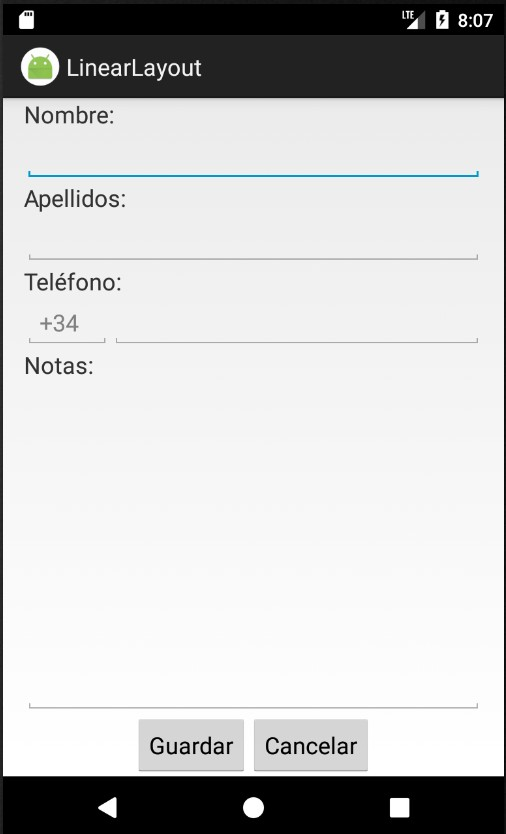
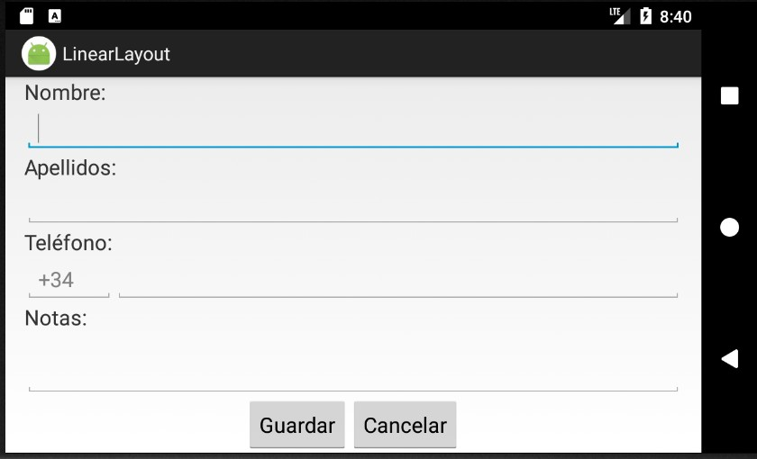
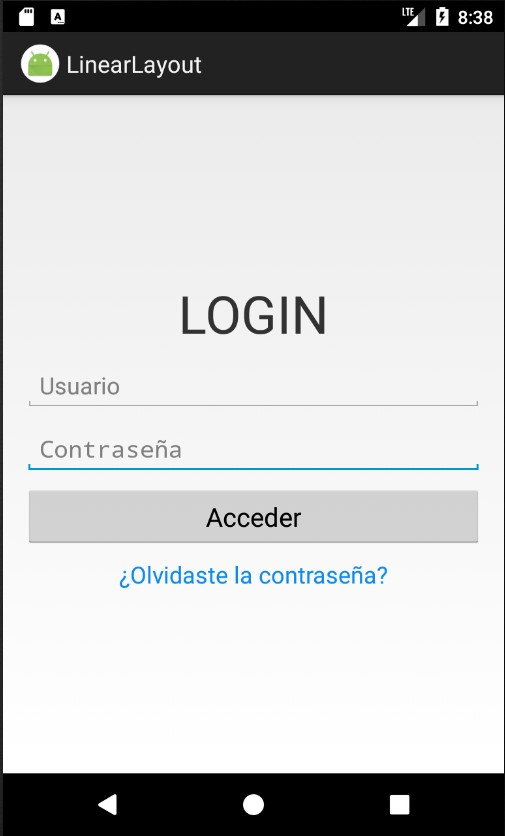
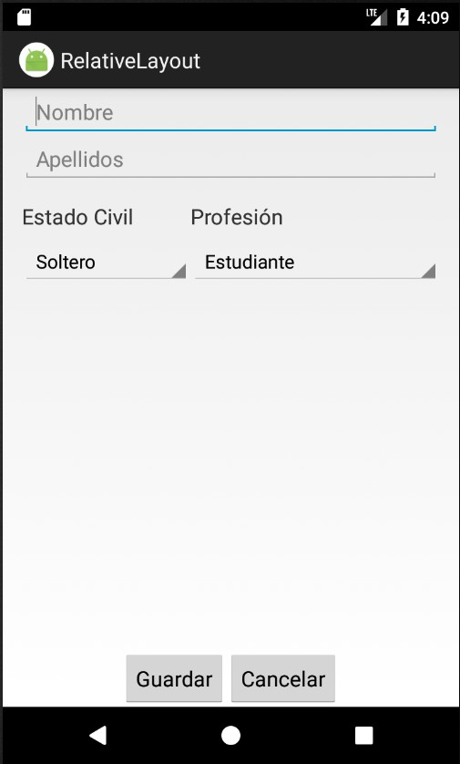
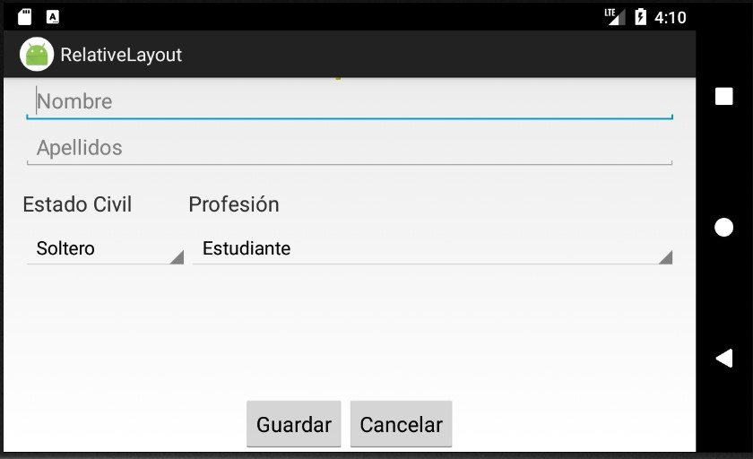
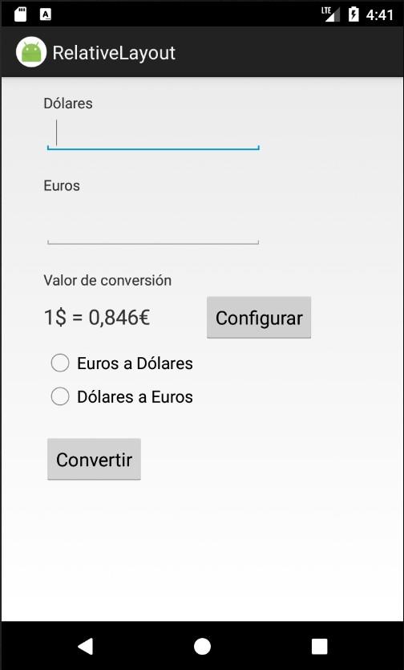
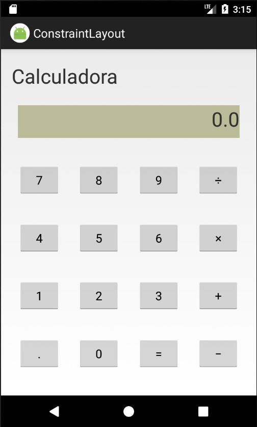

# 3.4. Interfaz de Usuario: Ejercicios Layouts

> **Módulo:** Programación Multimedia y Dispositivos Móviles (DAM 2)  
> **Unidad:** UT03 - Interfaz de Usuario en Android  
> **Apartado:** 3.4 - Ejercicios de Layouts (`LinearLayout`, `RelativeLayout`,
> `ConstraintLayout`)  
> **Documento oficial:** `3.4. Interfaz de Usuario - Ejercicios Layouts.pdf`

---

## Contenidos

1. [Ejercicio 1: Formulario básico con LinearLayout](#ejercicio-1-formulario-básico-con-linearlayout)
2. [Ejercicio 2: Pantalla de Login con LinearLayout](#ejercicio-2-pantalla-de-login-con-linearlayout)
3. [Ejercicio 3: Formulario con Spinners y RelativeLayout](#ejercicio-3-formulario-con-spinners-y-relativelayout)
4. [Ejercicio 4: Conversor de divisas con RelativeLayout](#ejercicio-4-conversor-de-divisas-con-relativelayout)
5. [Ejercicio 5: Interfaz de Calculadora con ConstraintLayout](#ejercicio-5-interfaz-de-calculadora-con-constraintlayout)

### Resumen de ejercicios y layouts

| Ej.   | Layout             | Elementos clave                    | Modos    |
| :---- | :----------------- | :--------------------------------- | :------- |
| **1** | `LinearLayout`     | `EditText`, prefijo `+34`, botones | V / H    |
| **2** | `LinearLayout`     | Login: credenciales, botón, enlace | V / H    |
| **3** | `RelativeLayout`   | Alineación relativa, `Spinner`     | V / H    |
| **4** | `RelativeLayout`   | `RadioGroup`, cambio divisas       | Vertical |
| **5** | `ConstraintLayout` | Matriz de botones, display         | Vertical |

---

## Ejercicio 1: Formulario básico con LinearLayout

Diseñar el siguiente interfaz de usuario utilizando **LinearLayout**.

### Requisitos visuales (Ejercicio 1)

- **Campos del formulario:**
  - `Nombre` (`EditText`)
  - `Apellidos` (`EditText`)
  - `Teléfono` con campo auxiliar de prefijo (`+34`) dispuesto en la misma fila
  - `Notas` (`EditText` multilínea)
- **Acciones:**
  - Botones `Guardar` y `Cancelar` dispuestos en disposición horizontal en la
    parte inferior.
- **Comportamiento adaptativo:**
  - La interfaz debe adaptarse adecuadamente tanto en modo vertical (_portrait_)
    como en modo horizontal (_landscape_).

### Maquetas de referencia (Ejercicio 1)

**Modo vertical:**

**Modo horizontal:**

---

## Ejercicio 2: Pantalla de Login con LinearLayout

Diseñar el siguiente interfaz de usuario utilizando **LinearLayout**.

### Requisitos visuales (Ejercicio 2)

- **Cabecera:** Título principal `LOGIN` destacado y centrado.
- **Campos de autenticación:**
  - Campo de entrada para `Usuario`.
  - Campo de entrada para `Contraseña` con ocultación de caracteres.
- **Acciones y enlaces:**
  - Botón principal de acceso: `Acceder`.
  - Enlace inferior de recuperación: `¿Olvidaste la contraseña?`.
- **Comportamiento adaptativo:**
  - El diseño debe mantenerse legible y centrado tanto en orientación vertical
    como horizontal.

### Maquetas de referencia (Ejercicio 2)

**Modo vertical:**

**Modo horizontal:**

---

## Ejercicio 3: Formulario con Spinners y RelativeLayout

Diseñar el siguiente interfaz de usuario utilizando **RelativeLayout**.

### Requisitos visuales (Ejercicio 3)

- **Datos personales:**
  - Entradas para `Nombre` y `Apellidos`.
- **Selectores desplegables (`Spinner`):**
  - Selector `Estado Civil` (ejemplo mostrado: "Soltero").
  - Selector `Profesión` (ejemplo mostrado: "Estudiante").
  - Ambos desplegables se ubican en una misma fila, alineados de forma relativa.
- **Acciones:**
  - Botones inferiores `Guardar` y `Cancelar` alineados a la parte inferior
    derecha.
- **Comportamiento adaptativo:**
  - Distribución responsiva en orientaciones vertical y horizontal.

### Maquetas de referencia (Ejercicio 3)

**Modo vertical:**

**Modo horizontal:**

---

## Ejercicio 4: Conversor de divisas con RelativeLayout

Diseñar el siguiente interfaz de usuario utilizando **RelativeLayout**.

### Requisitos visuales (Ejercicio 4)

- **Campos de importe:**
  - Campo numérico para `Dólares`.
  - Campo numérico para `Euros`.
- **Parámetros de conversión:**
  - Etiqueta informativa `Valor de conversión` con el factor de cambio fijado
    (`1$ = 0,846€`).
  - Botón `Configurar` alineado a la derecha de la tasa de conversión.
- **Sentido de la conversión:**
  - Grupo de opciones excluyentes (`RadioGroup` con `RadioButton`):
    - `Euros a Dólares`
    - `Dólares a Euros`
- **Acción:**
  - Botón `Convertir` centrado o posicionado bajo las opciones.

### Maqueta de referencia (Ejercicio 4)

---

## Ejercicio 5: Interfaz de Calculadora con ConstraintLayout

Diseñar el siguiente interfaz de usuario utilizando **ConstraintLayout**.

### Requisitos visuales (Ejercicio 5)

- **Barra superior / Identificador:** `Calculadora`.
- **Pantalla de visualización (`Display`):**
  - Área con fondo diferenciado y visualización numérica inicial (`0.0`).
- **Teclado numérico y de operaciones (cuadrícula 4x4):**
  - **Fila 1:** `7` | `8` | `9` | `÷`
  - **Fila 2:** `4` | `5` | `6` | `×`
  - **Fila 3:** `1` | `2` | `3` | `+`
  - **Fila 4:** `.` | `0` | `=` | `-`
- **Distribución de restricciones:**
  - Botones distribuidos uniformemente mediante cadenas (_chains_) horizontales
    y verticales o mediante directrices (_guidelines_) en `ConstraintLayout`.

### Maqueta de referencia (Ejercicio 5)

