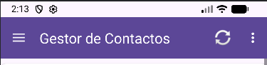
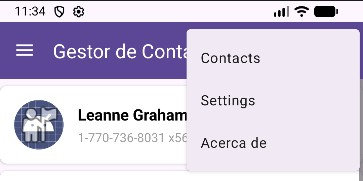
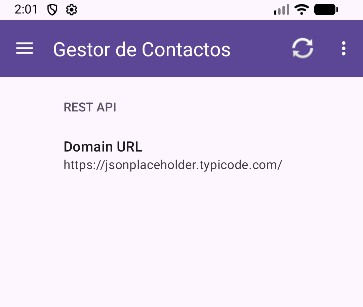
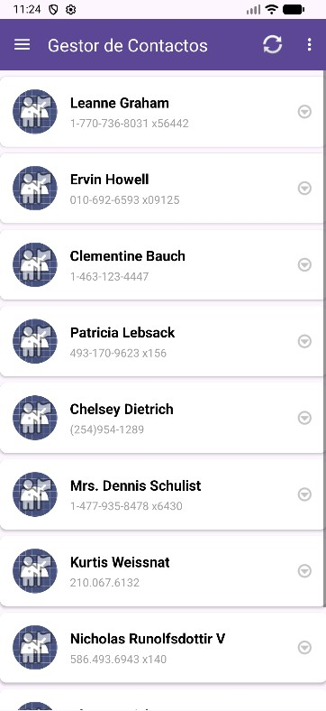
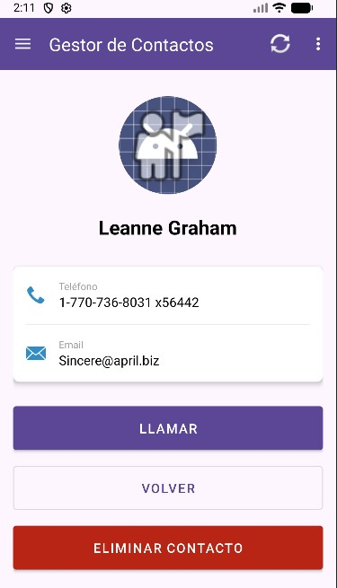
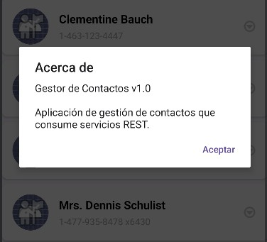

# Práctica / Examen: Gestor de Contactos REST

> **Módulo:** Programación Multimedia y Dispositivos Móviles (DAM 2)  
> **Unidades:** UT03 (UI & Fragments), UT04 (Consumo de APIs REST &
> Concurrencia), UT06 (SharedPreferences)  
> **Tema:** Desarrollo de aplicación cliente REST con Retrofit, Fragments y
> SharedPreferences  
> **Documento oficial:** `Enunciado.pdf`  
> **Servicio REST API:**
> [`https://jsonplaceholder.typicode.com/users`](https://jsonplaceholder.typicode.com/users)

---

## Contenidos

1. [Enunciado general](#enunciado-general)
2. [Endpoints del servicio REST](#endpoints-del-servicio-rest)
3. [Estructura del modelo de datos](#estructura-del-modelo-de-datos)
4. [MainActivity](#mainactivity)
5. [Fragment 1: SharedPreferences (SettingsFragment.java)](#fragment-1-sharedpreferences-settingsfragmentjava)
6. [Fragment 2: Lista de Contactos (ContactListFragment)](#fragment-2-lista-de-contactos-contactlistfragment)
7. [Fragment 3: Detalle del Contacto (ContactDetailFragment)](#fragment-3-detalle-del-contacto-contactdetailfragment)
8. [Implementación de los fragments y Back Stack](#implementación-de-los-fragments-y-back-stack)
9. [Diálogo ‘Acerca de’](#diálogo-acerca-de)

---

## Enunciado general

Debes desarrollar una aplicación Android que permita gestionar una lista de
contactos consumiendo el servicio REST disponible en:

<https://jsonplaceholder.typicode.com/users>

En el caso en que el servicio no esté disponible durante la realización del
examen o exista algún problema de conexión, el alumno simular el servicio
utilizando “JSON server” en su equipo local o solicitando al profesor que lo
haga disponible en su ordenador.

Para la implementación del cliente REST utiliza **Retrofit y peticiones
asíncronas (callbacks)**. La URL del servicio será **configurable** a través de
SharedPreferences.

---

## Endpoints del servicio REST

Utilizaremos los siguientes endpoints:

| Método HTTP | Endpoint      | Descripción                               |
| :---------- | :------------ | :---------------------------------------- |
| **GET**     | `/users`      | Obtener lista de todos los contactos      |
| **GET**     | `/users/{id}` | Obtener detalle de un contacto específico |
| **DELETE**  | `/users/{id}` | Eliminar un contacto                      |

---

## Estructura del modelo de datos

La estructura del objeto contacto que deberás utilizar para la solución es la
siguiente:

```json
{
  "id": 1,
  "name": "Nombre Completo",
  "phone": "912987654",
  "email": "email@example.com"
}
```

---

## MainActivity

- Actuará como contenedor de fragmentos y dispondrá de un **Toolbar/ActionBar**
  con el titulo “Gestor de Contactos” y un menú de opciones (**OptionsMenu**)
  con las opciones:
  - `"Actualizar contactos"`: recarga los contactos desde el servidor y los
    carga en el `ListView` del `ContactListFragment`, solo en el caso en que sea
    el fragment visible en el momento del click.
  - `“Contacts”`: carga la lista de contactos.
  - `“Settings”`: carga las `SharedPreferences`.
  - `"Acerca de"`: muestra información de la app.
- Haz que el menú esté **internacionalizado en Español e Inglés**.

### Vistas de referencia de la barra de acciones y menú

**Barra principal:**



**Menú desplegado:**



---

## Fragment 1: SharedPreferences (SettingsFragment.java)

- Muestra las preferencias de la aplicación según se describe en la imagen.
- Mediante una ventana de dialogo que se abrirá al hacer click sobre ‘Domain
  URL’, se podrá configurar la URL del servicio REST (host y puerto).
- Puedes realizar el desarrollo utilizando un Fragment y LinearLayout e
  implementando toda la lógica de almacenamiento y recuperación de las
  SharedPreferences, o utilizando **PreferenceFragment** siguiendo la
  documentación de Android Developer.

### Vista de referencia (Fragment 1)



---

## Fragment 2: Lista de Contactos (ContactListFragment)

- Muestra la lista de contactos utilizando un **ListView**.
- El fragment en su creación, realiza una petición **GET** para obtener todos
  los contactos del servicio REST.
- Para cada contacto debe mostrar: nombre, teléfono e imagen (un icono genérico
  de los disponibles en **@android:drawable**).
- Implementa un **ProgressBar** para indicar que se está cargando la
  información.
- Añade un TextView con el mensaje "**No hay contactos**", que sea visible solo
  si la lista de contactos está vacía.
- El **ListView** deberá permitir scroll en el caso en que existan más contactos
  que los visibles en pantalla.
- Al pulsar sobre un contacto, debe navegar al fragment de detalle pasando como
  argumentos (**Bundle**) el ID del contacto seleccionado.

### Vista de referencia (Fragment 2)



---

## Fragment 3: Detalle del Contacto (ContactDetailFragment)

- Recibe el ID del contacto mediante argumentos (**Bundle**).
- Realiza una petición **GET** individual para obtener los detalles del contacto
  seleccionado.
- Muestra todos los campos del contacto.
- Implementa un botón para realizar una llamada telefónica al contacto (usando
  **Intent implícito**).
- Implementa un botón para **eliminar** el contacto que realiza una petición
  DELETE al servicio REST con confirmación previa mediante **AlertDialog**.
- Tras eliminar correctamente, navega de vuelta al fragment de la lista de
  contactos.
- Implementa un botón "**Volver**" que regrese al fragment de la lista de
  contactos.

### Vista de referencia (Fragment 3)



---

## Implementación de los fragments y Back Stack

- Deberá realizarse utilizando **FragmentManager** y **FragmentTransaction**.
- Gestiona correctamente la pila de retroceso (**back stack**) para que el botón
  "Atrás" funcione adecuadamente y vuelva al fragmento que corresponda en cada
  caso y según se detalló en los apartados anteriores.

---

## Diálogo ‘Acerca de’

- Implementa el dialogo que se abre al seleccionar la opción “**Acerca de**”
  utilizando **AlertDialog** y haz que contenga la información de la imagen.

### Vista de referencia (Diálogo Acerca de)


